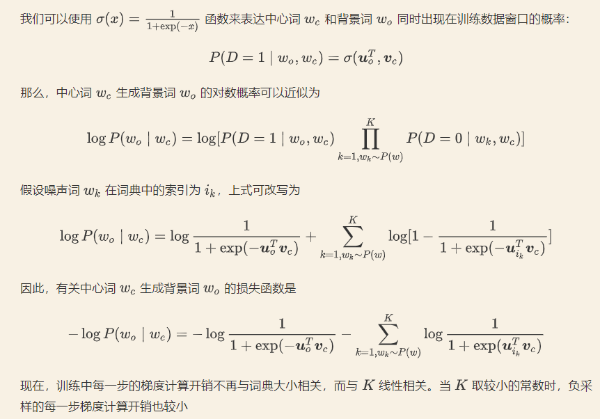

# SkipGram_Negative_Sampling

Pytorch implementation of skipgram model with negative sampling.

## Concept of word2vec

- [https://jalammar.github.io/illustrated-word2vec/](https://jalammar.github.io/illustrated-word2vec/)
- [https://wmathor.com/index.php/archives/1430/](https://wmathor.com/index.php/archives/1430/)



## Supported features

* Skip-gram

* Batch update

* Sub-sampling of frequent word

* Negative Sampling

* GPU support

## Visualization

Save the embedding along with the words to TSV files as shown below, upload these two TSV files to [Embedding Projector](https://projector.tensorflow.org/) for better visualization.

```
def save_embedding(self, outdir, idx2word):
    embeds = self.in_embed.weight.data.cpu().numpy()        
    f1 = open(os.path.join(outdir, 'vec.tsv'), 'w')
    f2 = open(os.path.join(outdir, 'word.tsv'), 'w')        
    for idx in range(len(embeds)):
        word = idx2word[idx]
        embed = '\t'.join([str(x) for x in embeds[idx]])
        f1.write(embed+'\n')
        f2.write(word+'\n')
```
