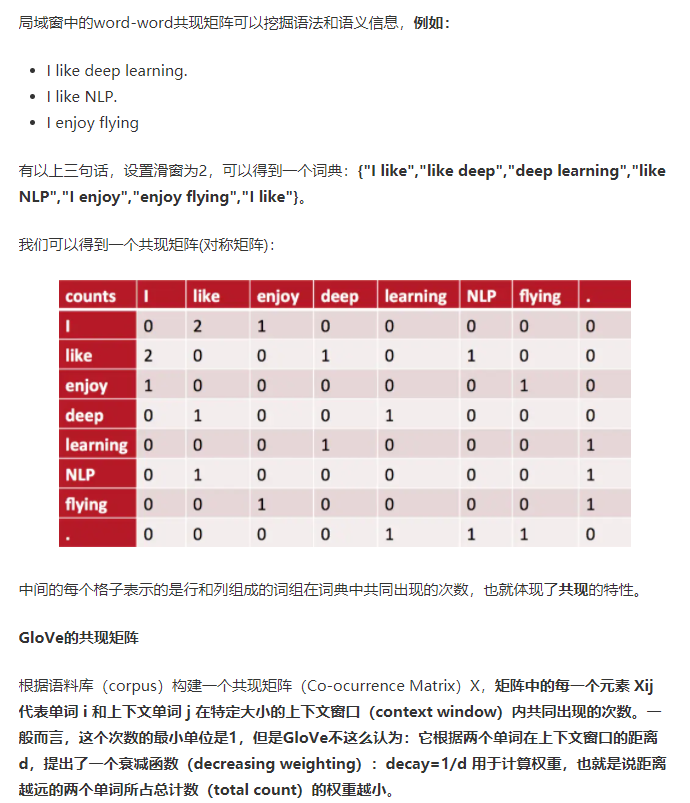
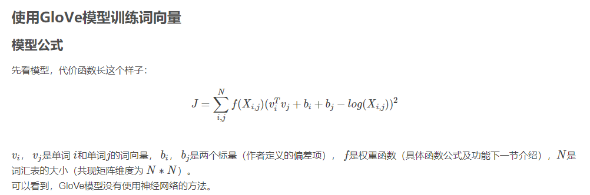
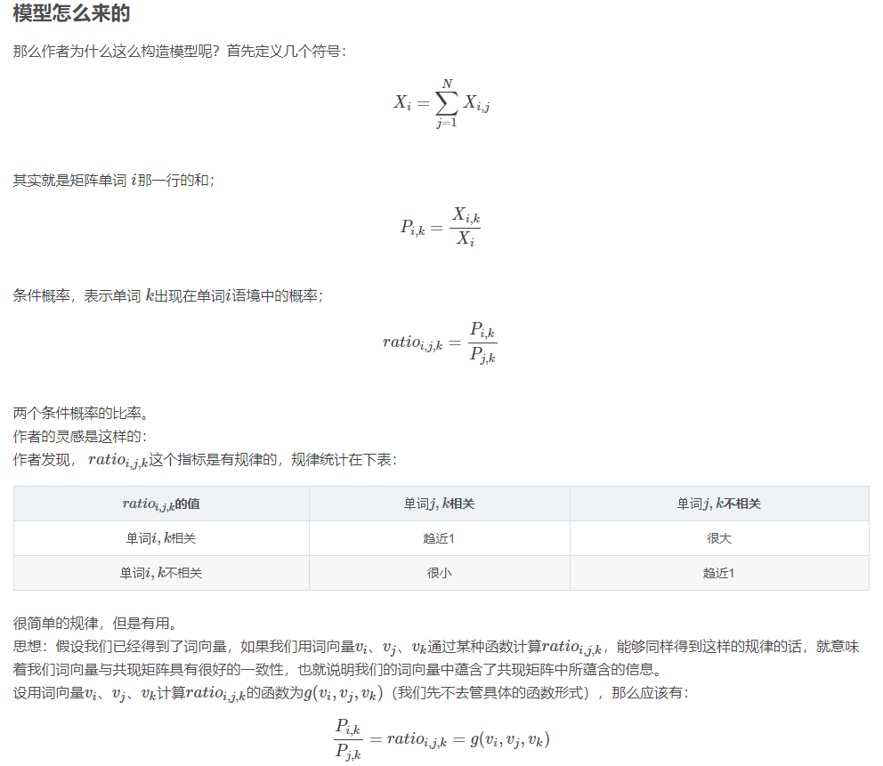
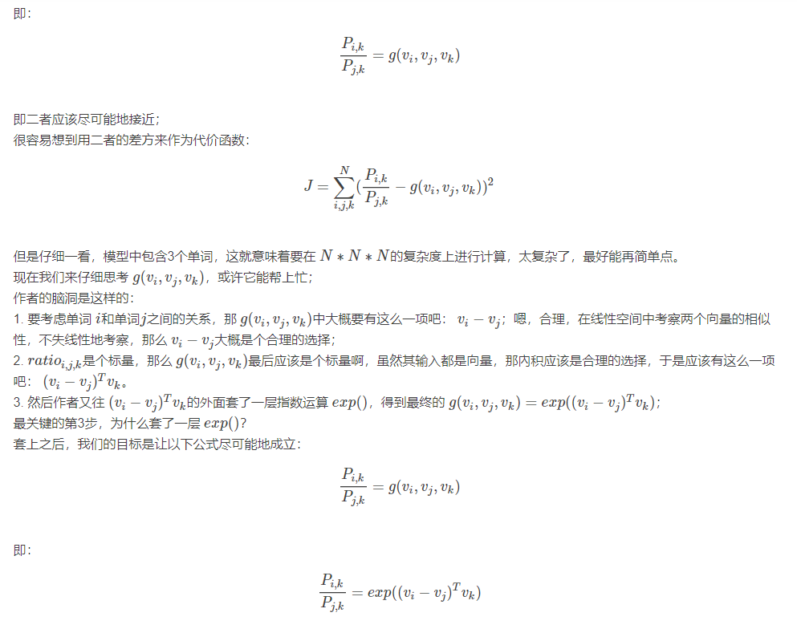
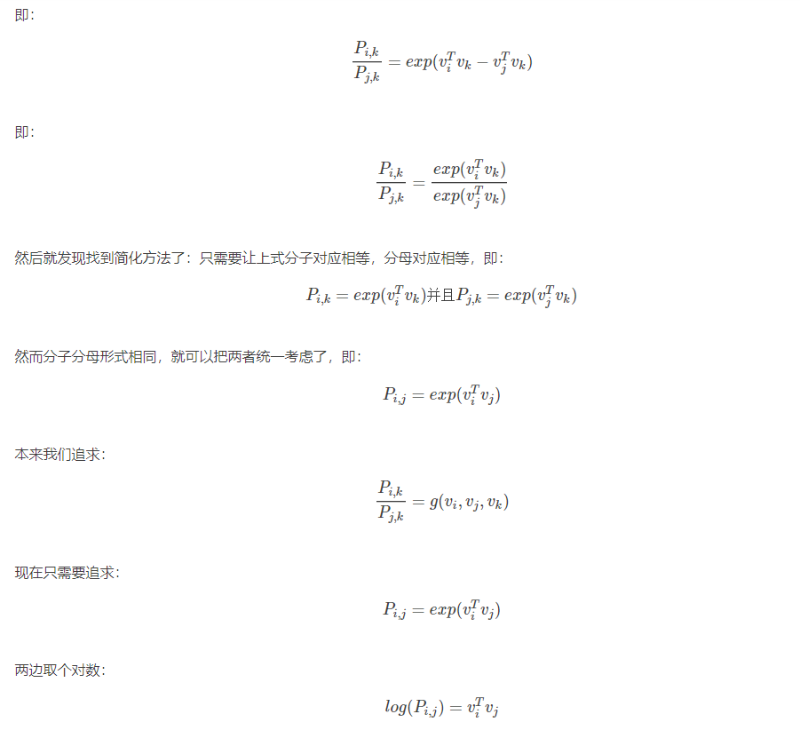
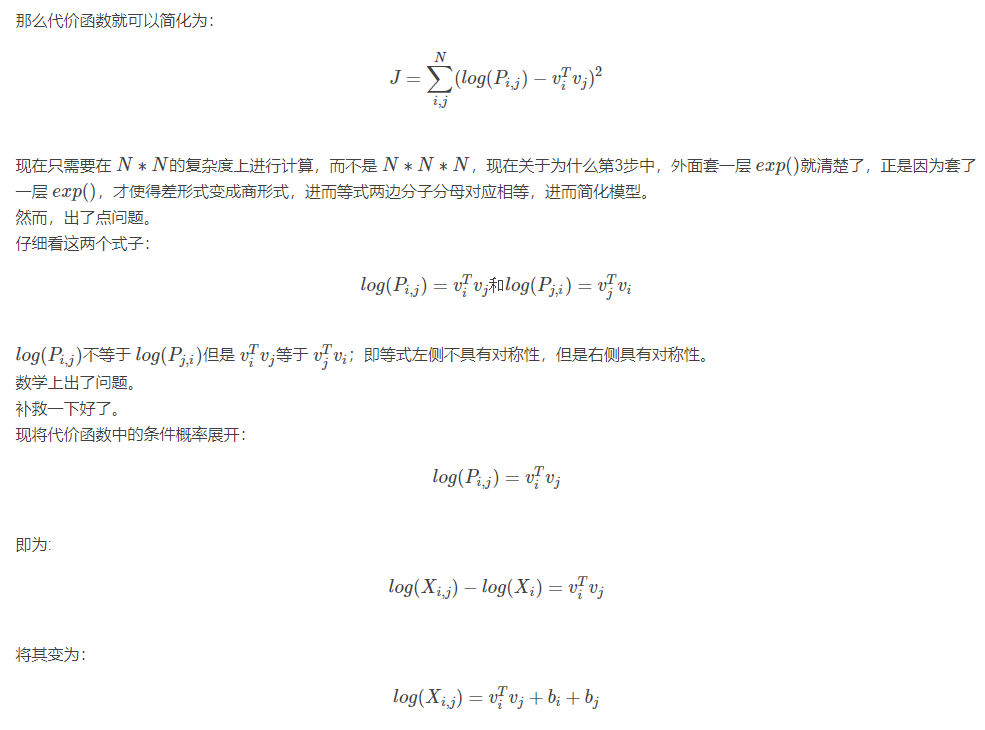
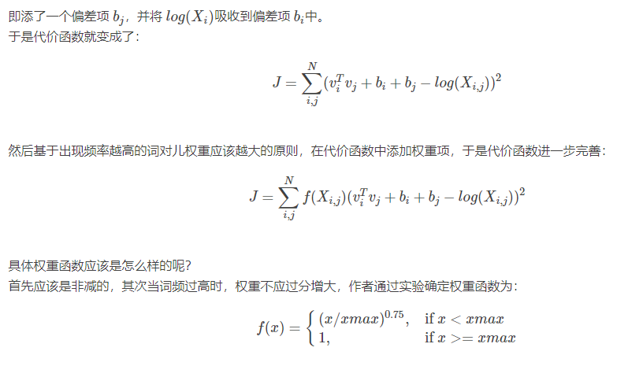
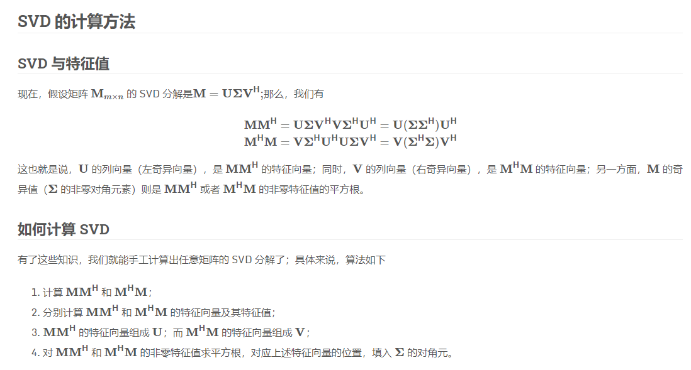
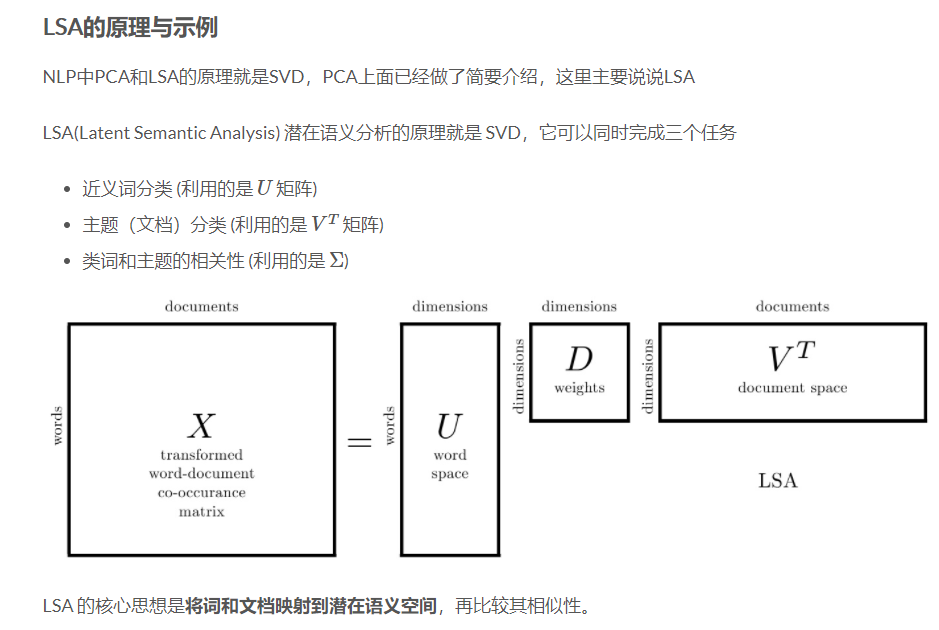
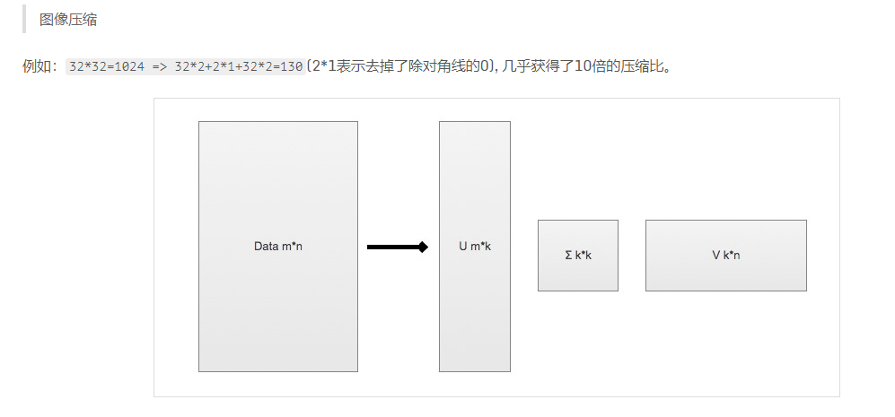

# Pytorch implementation of Glove

## 原理

- [https://blog.csdn.net/coderTC/article/details/73864097](https://blog.csdn.net/coderTC/article/details/73864097)
- [https://juejin.cn/post/6844903923279642638](https://juejin.cn/post/6844903923279642638)
- [https://nlpython.com/implementing-glove-model-with-pytorch/](https://nlpython.com/implementing-glove-model-with-pytorch/)









### 附SVD及应用




## 可视化

Save the embedding along with the words to TSV files as shown below, upload these two TSV files to [Embedding Projector](https://projector.tensorflow.org/) for better visualization.

```
def save_embedding(self, outdir, idx2word):
    embeds = self.in_embed.weight.data.cpu().numpy()        
    f1 = open(os.path.join(outdir, 'vec.tsv'), 'w')
    f2 = open(os.path.join(outdir, 'word.tsv'), 'w')        
    for idx in range(len(embeds)):
        word = idx2word[idx]
        embed = '\t'.join([str(x) for x in embeds[idx]])
        f1.write(embed+'\n')
        f2.write(word+'\n')
```
