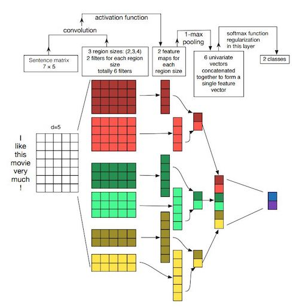

# Pytorch implementation of TextCNN



```
python train_eval.py

[I 2021-04-13 14:05:46,522] A new study created in memory with name: no-name-599e14ca-5d4a-4605-8d2e-33abee2fc4ad
[I 2021-04-13 14:06:50,214] Trial 0 finished with value: 0.8541428571428571 and parameters: {'kernel_num': 150, 'n_embedding': 200, 'optimizer': 'Adam', 'lr': 1.5027946942986322e-05}. Best is trial 0 with value: 0.8541428571428571.
[I 2021-04-13 14:07:52,647] Trial 1 finished with value: 0.7934285714285715 and parameters: {'kernel_num': 150, 'n_embedding': 250, 'optimizer': 'SGD', 'lr': 5.322510112333669e-05}. Best is trial 0 with value: 0.8541428571428571.
[I 2021-04-13 14:08:43,625] Trial 2 finished with value: 0.8894285714285715 and parameters: {'kernel_num': 100, 'n_embedding': 300, 'optimizer': 'RMSprop', 'lr': 3.197609296140763e-05}. Best is trial 2 with value: 0.8894285714285715.
[I 2021-04-13 14:09:37,426] Trial 3 finished with value: 0.7554285714285714 and parameters: {'kernel_num': 150, 'n_embedding': 200, 'optimizer': 'SGD', 'lr': 3.3763296243117875e-05}. Best is trial 2 with value: 0.8894285714285715.
[I 2021-04-13 14:10:30,940] Trial 4 finished with value: 0.937 and parameters: {'kernel_num': 150, 'n_embedding': 200, 'optimizer': 'SGD', 'lr': 0.008711590063477607}. Best is trial 4 with value: 0.937.
[I 2021-04-13 14:12:30,811] Trial 5 finished with value: 0.9484285714285714 and parameters: {'kernel_num': 300, 'n_embedding': 300, 'optimizer': 'RMSprop', 'lr': 0.002250497726315542}. Best is trial 5 with value: 0.9484285714285714.
[I 2021-04-13 14:13:33,791] Trial 6 finished with value: 0.8761428571428571 and parameters: {'kernel_num': 150, 'n_embedding': 250, 'optimizer': 'SGD', 'lr': 0.00021453357408450884}. Best is trial 5 with value: 0.9484285714285714.
[I 2021-04-13 14:14:36,861] Trial 7 finished with value: 0.9164285714285715 and parameters: {'kernel_num': 150, 'n_embedding': 250, 'optimizer': 'RMSprop', 'lr': 5.9209071745487076e-05}. Best is trial 5 with value: 0.9484285714285714.
Study statistics: 
  Number of finished trials:  8
  Number of pruned trials:  0
  Number of complete trials:  8
Best trial:
  Value:  0.9484285714285714
  Params: 
    kernel_num: 300
    n_embedding: 300
    optimizer: RMSprop
    lr: 0.002250497726315542
```
