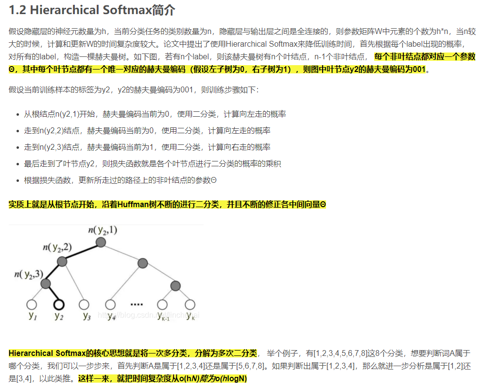

# Pytorch implementation of FastText

## 1. [Hierarchical softmax 简介](https://blog.csdn.net/kingsonyoung/article/details/90757879)


## 2. FastText 结构


注：代码中考虑unigram,bigram,trigram特征，模型有三层：输入层、隐含层、输出层，并未实现Hierarchical Softmax。

```
python train_eval.py

[I 2021-04-13 15:04:12,838] A new study created in memory with name: no-name-c15209e9-68cc-4038-a8d7-6b77faf6a7f1
[I 2021-04-13 15:04:50,472] Trial 0 finished with value: 0.4908571428571429 and parameters: {'n_embedding': 250, 'hidden_size': 66, 'optimizer': 'SGD', 'lr': 4.828190712378228e-05}. Best is trial 0 with value: 0.4908571428571429.
[I 2021-04-13 15:05:26,262] Trial 1 finished with value: 0.5397142857142857 and parameters: {'n_embedding': 200, 'hidden_size': 92, 'optimizer': 'SGD', 'lr': 0.0033509677606887735}. Best is trial 1 with value: 0.5397142857142857.
[I 2021-04-13 15:06:06,346] Trial 2 finished with value: 0.9495714285714286 and parameters: {'n_embedding': 200, 'hidden_size': 80, 'optimizer': 'RMSprop', 'lr': 0.09581501814031017}. Best is trial 2 with value: 0.9495714285714286.
[I 2021-04-13 15:06:46,092] Trial 3 finished with value: 0.947 and parameters: {'n_embedding': 200, 'hidden_size': 126, 'optimizer': 'RMSprop', 'lr': 0.0005207158812149409}. Best is trial 2 with value: 0.9495714285714286.
[I 2021-04-13 15:07:33,283] Trial 4 finished with value: 0.8395714285714285 and parameters: {'n_embedding': 300, 'hidden_size': 88, 'optimizer': 'Adam', 'lr': 3.463440990098863e-05}. Best is trial 2 with value: 0.9495714285714286.
[I 2021-04-13 15:07:37,122] Trial 5 pruned. 
[I 2021-04-13 15:07:40,695] Trial 6 pruned. 
[I 2021-04-13 15:08:28,117] Trial 7 finished with value: 0.9487142857142857 and parameters: {'n_embedding': 300, 'hidden_size': 106, 'optimizer': 'Adam', 'lr': 0.015206317643266073}. Best is trial 2 with value: 0.9495714285714286.
Study statistics: 
  Number of finished trials:  8
  Number of pruned trials:  2
  Number of complete trials:  6
Best trial:
  Value:  0.9495714285714286
  Params: 
    n_embedding: 200
    hidden_size: 80
    optimizer: RMSprop
    lr: 0.09581501814031017
```
