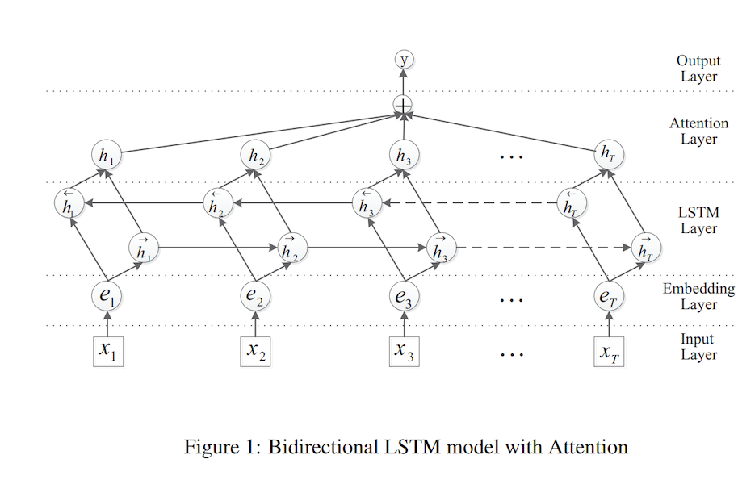
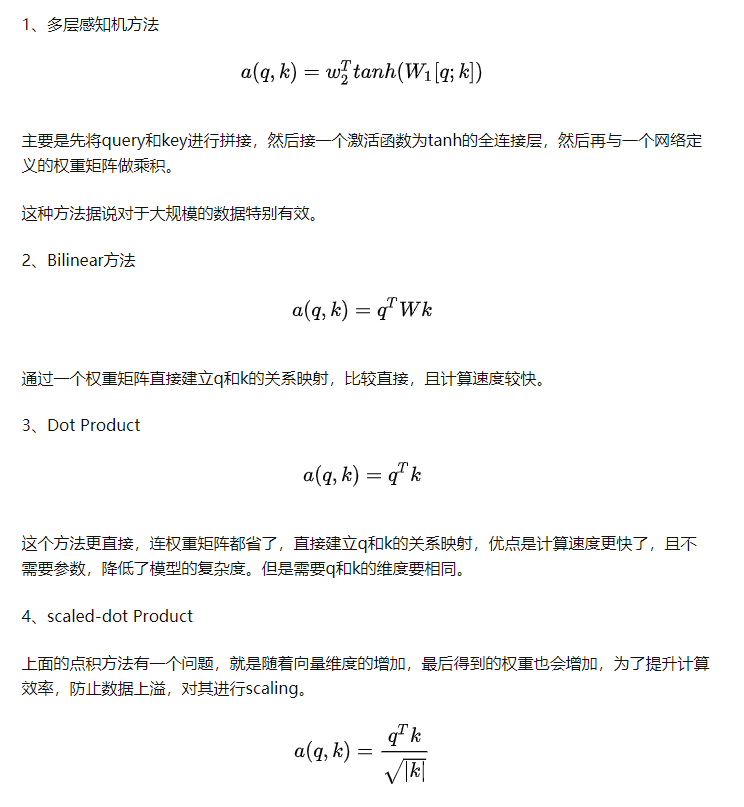

# Pytorch implementation of TextRNN with Attention



## [Attention score 的几种常用算法](https://zhuanlan.zhihu.com/p/46313756):



```
python train_eval.py

[I 2021-04-15 13:13:44,793] A new study created in memory with name: no-name-4a90b96e-fbf7-4e72-adeb-da684ceed19f
[I 2021-04-15 13:14:37,289] Trial 0 finished with value: 0.9294285714285714 and parameters: {'n_embedding': 200, 'hidden_size': 100, 'optimizer': 'RMSprop', 'lr': 0.0001853994037866895}. Best is trial 0 with value: 0.9294285714285714.
[I 2021-04-15 13:15:23,352] Trial 1 finished with value: 0.8761428571428571 and parameters: {'n_embedding': 300, 'hidden_size': 94, 'optimizer': 'Adam', 'lr': 1.0835871682590818e-05}. Best is trial 0 with value: 0.9294285714285714.
[I 2021-04-15 13:16:10,716] Trial 2 finished with value: 0.8148571428571428 and parameters: {'n_embedding': 200, 'hidden_size': 122, 'optimizer': 'SGD', 'lr': 0.013237856919367678}. Best is trial 0 with value: 0.9294285714285714.
[I 2021-04-15 13:16:48,939] Trial 3 finished with value: 0.9162857142857143 and parameters: {'n_embedding': 200, 'hidden_size': 88, 'optimizer': 'RMSprop', 'lr': 8.361493240228295e-05}. Best is trial 0 with value: 0.9294285714285714.
[I 2021-04-15 13:17:37,421] Trial 4 finished with value: 0.5425714285714286 and parameters: {'n_embedding': 300, 'hidden_size': 112, 'optimizer': 'SGD', 'lr': 0.00015357920706099987}. Best is trial 0 with value: 0.9294285714285714.
[I 2021-04-15 13:18:25,099] Trial 5 finished with value: 0.9307142857142857 and parameters: {'n_embedding': 200, 'hidden_size': 114, 'optimizer': 'Adam', 'lr': 8.984871136052002e-05}. Best is trial 5 with value: 0.9307142857142857.
[I 2021-04-15 13:19:14,226] Trial 6 finished with value: 0.9212857142857143 and parameters: {'n_embedding': 250, 'hidden_size': 122, 'optimizer': 'RMSprop', 'lr': 0.012525772910558392}. Best is trial 5 with value: 0.9307142857142857.
[I 2021-04-15 13:19:42,589] Trial 7 pruned. 
Study statistics: 
  Number of finished trials:  8
  Number of pruned trials:  1
  Number of complete trials:  7
Best trial:
  Value:  0.9307142857142857
  Params: 
    n_embedding: 200
    hidden_size: 114
    optimizer: Adam
    lr: 8.984871136052002e-05
```
