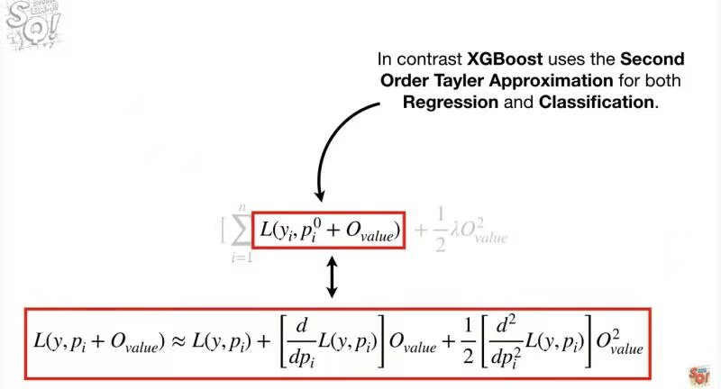

# XGBoost for classification

**如图所示，XGBoost 的损失函数是一个带有正则项的二阶泰勒展开式，**[点击观看完整视频](https://www.youtube.com/watch?v=OtD8wVaFm6E)。




```
python train_eval.py

[I 2021-04-12 16:10:08,089] A new study created in memory with name: no-name-65acf685-e5bb-47ba-b0aa-a17621e81092
[I 2021-04-12 16:11:39,531] Trial 0 finished with value: 0.7778571428571428 and parameters: {'eta': 6.257307527601398e-05, 'max_depth': 7, 'gamma': 0.816157018196906, 'min_child_weight': 7}. Best is trial 0 with value: 0.7778571428571428.
[I 2021-04-12 16:13:13,331] Trial 1 finished with value: 0.82 and parameters: {'eta': 0.13563108904278048, 'max_depth': 9, 'gamma': 7.449975365264404e-05, 'min_child_weight': 8}. Best is trial 1 with value: 0.82.
[I 2021-04-12 16:14:06,754] Trial 2 finished with value: 0.8431428571428572 and parameters: {'eta': 0.8518246667395151, 'max_depth': 5, 'gamma': 2.8425235272597573e-08, 'min_child_weight': 2}. Best is trial 2 with value: 0.8431428571428572.
[I 2021-04-12 16:14:41,461] Trial 3 finished with value: 0.7188571428571429 and parameters: {'eta': 0.0022115000839254516, 'max_depth': 3, 'gamma': 0.0007099484519200604, 'min_child_weight': 8}. Best is trial 2 with value: 0.8431428571428572.
[I 2021-04-12 16:15:54,486] Trial 4 finished with value: 0.7771428571428571 and parameters: {'eta': 3.710261013455784e-06, 'max_depth': 7, 'gamma': 0.00020249472395005247, 'min_child_weight': 10}. Best is trial 2 with value: 0.8431428571428572.
[I 2021-04-12 16:16:47,854] Trial 5 finished with value: 0.8122857142857143 and parameters: {'eta': 0.2635322705238699, 'max_depth': 5, 'gamma': 0.01815947857890702, 'min_child_weight': 10}. Best is trial 2 with value: 0.8431428571428572.
[I 2021-04-12 16:18:20,553] Trial 6 finished with value: 0.7981428571428572 and parameters: {'eta': 0.021100086452231995, 'max_depth': 9, 'gamma': 0.4145066056939733, 'min_child_weight': 5}. Best is trial 2 with value: 0.8431428571428572.
[I 2021-04-12 16:19:13,790] Trial 7 finished with value: 0.7624285714285715 and parameters: {'eta': 0.00022271399260092282, 'max_depth': 5, 'gamma': 0.45871989182900147, 'min_child_weight': 5}. Best is trial 2 with value: 0.8431428571428572.
Number of finished trials:  8
Best trial:
  Value: 0.8431428571428572
  Params: 
    eta: 0.8518246667395151
    max_depth: 5
    gamma: 2.8425235272597573e-08
    min_child_weight: 2
```
