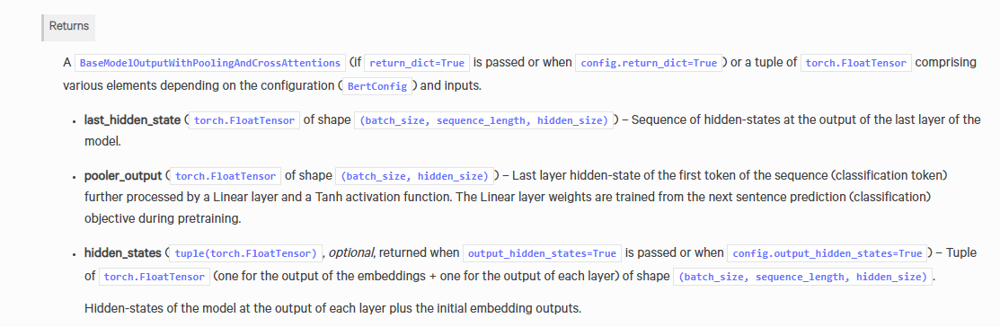

# Distill fine-tune Bert

## 1. Concept of Bert and distillation

- [The Illustrated BERT](https://jalammar.github.io/illustrated-bert/)
- [A Visual Guide to Using BERT for the First Time](https://jalammar.github.io/a-visual-guide-to-using-bert-for-the-first-time/)
- [Hands-on coding in PyTorch — Compressing BERT](https://medium.com/huggingface/distilbert-8cf3380435b5)

## 2. 数据预处理
```
load_data.py 里，将数据处理成 [CLS] + tokens + [SEP] + [PAD](0个或多个)的形式，固定sequence length为35，并生成相应的mask。

注：BERT由于position-embedding的限制，输入的最大长度为512, 其中还需要包括[CLS]和[SEP]. 那么实际可用的长度仅为510。
```
## 3. Fine tune Bert
```
model.py:
1. 结构为 Bert+TextRCNN
2. Bert 的输出如图片所示，模型里选择Bert倒数第二层的隐向量传入Bilstm，而不是最后一层，是因为倒数第二层不那么接近任务，但是又能学习到句子的较高层的语义。

训练：python train_eval.py
```


## 4. 蒸馏上一步生成的大模型至小模型
```
1. 大模型也被称为教师模型，小模型被称为学生模型。学生模型学习的是教师模型的softmax层的输出概率分布，以便直接学习到其泛化能力。
2. 温度的高低改变的是学生模型训练过程中对负标签的关注程度。
- 从有部分信息量的负标签中学习 --> 温度高一些
- 防止受负标签中的噪声的影响 --> 温度低一些
- 温度的选择和学生模型的大小有关，代码里选择T=5作为demo。
3. 我们用K-L散度(https://www.countbayesie.com/blog/2017/5/9/kullback-leibler-divergence-explained)，来量化学生模型和教师模型的softmax层的差异。

python distill.py
```
## 5. TODO
```
尝试采用中文BERT-wwm预训练模型(https://github.com/ymcui/Chinese-BERT-wwm)，其预训练阶段的改进有：
- 在全词Mask中，如果一个完整的词的部分WordPiece子词被mask，则同属该词的其他部分也会被mask，即全词Mask。
- 取消Next Sentence Prediction（NSP）loss
```
## 6. 其他

### RoBERTa：
基于Bert的新的训练策略：

1.用更长的时间，更大的batch size，更多的数据进行训练

2.去掉BERT中的NSP目标(next sentence prediction)

3.在更长的句子上进行训练

4.根据训练数据动态地改变mask的模式

### ALbert:
1.Embedding层因式分解

2.跨层的参数共享

3.Bert的Next sentence prediction预训练任务：二分类；训练数据的正样本：同一个文档中的两个连续的句子；负样本：采用两个不同的文档的句子。ALbert的sentence-order-prediction预训练任务：增加难度的二分类；训练数据的正样本：同一个文档中的两个连续的句子；负样本：把正样本的数据反转得到。

### Transformer-XL:
引入循环机制和相对位置编码，解决Transformer长度限制的问题

### XLNet:
自回归语言模型（Autoregressive LM）:根据上文内容预测下一个可能跟随的单词，就是常说的自左向右的语言模型任务，或者反过来也行，就是根据下文预测前面的单词，这种类型的LM被称为自回归语言模型。GPT 就是典型的自回归语言模型。自回归语言模型缺点是只能利用上文或者下文的信息，不能同时利用上文和下文的信息。优点是天然匹配一些生成类NLP任务，比如文本摘要，机器翻译等，在实际生成内容的时候，就是从左向右的。

自编码语言模型（Autoencoder LM）：自回归语言模型只能根据上文预测下一个单词，或者反过来，只能根据下文预测前面一个单词。相比而言，Bert通过在输入X中随机Mask掉一部分单词，然后预训练过程的主要任务之一是根据上下文单词来预测这些被Mask掉的单词，它能比较自然地融入双向语言模型，同时看到被预测单词的上文和下文。缺点在于输入侧引入[Mask]标记，导致预训练阶段和Fine-tuning阶段不一致的问题，另外一个是，Bert在第一个预训练阶段，假设句子中多个单词被Mask掉，这些被Mask掉的单词之间没有任何关系，是条件独立的，而有时候这些单词之间是有关系的。

XLNet融合Transformer-XL + GPT的自回归模式 + bert的双向语言模型 + 双流自注意力机制去除[Mask]标识符

Reference:

https://towardsdatascience.com/what-is-xlnet-and-why-it-outperforms-bert-8d8fce710335

https://towardsdatascience.com/what-is-two-stream-self-attention-in-xlnet-ebfe013a0cf3

https://zhuanlan.zhihu.com/p/70257427
