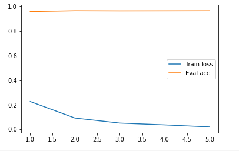

# 利用MLM做文本分类

## 1. 参考

- [《必须要GPT3吗？不，BERT的MLM模型也能小样本学习 》](https://spaces.ac.cn/archives/7764)

## 2. 实验结果
```
eval.py：零样本学习，直接使用pretrain的MLM模型在验证集上预测，准确率为0.74。

train_eval.py：小样本学习，抽取5000条训练语料在MLM模型上进行fine-tune，验证集上的准确率可达0.965。结果如图所示：


```