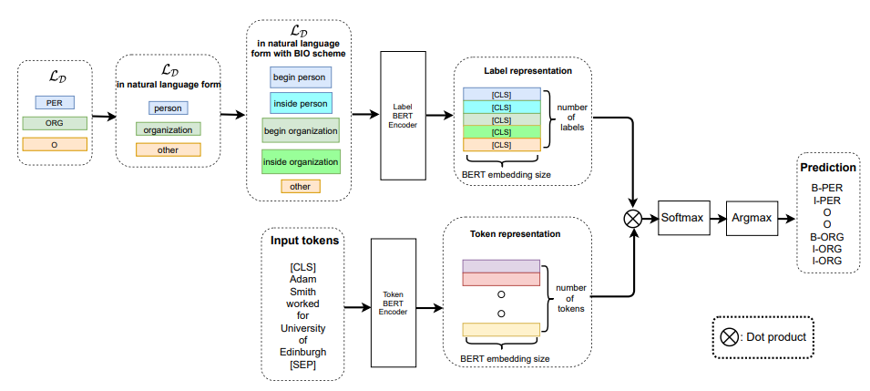

# Label Semantics for Few Shot Named Entity Recognition

### 原理
```
借鉴双塔模型来解决Few shot NER的问题，用两个BERT Encoder，一个Encoder编码每个token的表征，另一个Encoder对label的BIO tag的自然语言形式(或者用其他文本对Label进行描述)进行编码，获取Label 表征，
然后求待预测文本中每个token与所有label表征的相似度，求相似度最大的label。
```


### 模型预测效果

run demo_eval.py

```
Sent: 去年11月22日，河北省一位领导同志到故城县搞调研，在实地考察了郑口、饶阳店两镇的政务公开工作后说，故城县搞政务公开虽然时间不长，但效果很好，公开的思路清晰、内容全面、形式规范。
NER: [['河北省', 'LOC'], ['故城县', 'LOC'], ['郑口', 'LOC'], ['饶阳店', 'LOC'], ['故城县', 'LOC']]
Predicted NER: [['河北省', 'LOC'], ['故城县', 'LOC'], ['郑口', 'LOC'], ['饶阳店', 'LOC'], ['故城', 'LOC']]
---------------

Sent: 不久前，笔者对故城县乡、村政务公开情况进行了采访。
NER: [['故城县', 'LOC']]
Predicted NER: [['故城县', 'LOC']]
---------------

Sent: 近些年来，由于少数干部办事不公，财务不清，以权谋私而引发的农民上访呈逐年上升势头。
NER: []
Predicted NER: []
---------------

Sent: 故城县委、县政府千方百计加以解决，结果总是摁下葫芦起来瓢。
NER: [['故城县委', 'ORG']]
Predicted NER: [['故城县委', 'ORG']]
---------------

Sent: 去年3月，河北省委提出实施[UNK]鱼水工程[UNK]，推行政务公开。
NER: [['河北省委', 'ORG']]
Predicted NER: [['河北省委', 'ORG']]
---------------

Sent: 县委领导同志认为这是解决农村诸多难题，启动农民积极性的[UNK]金钥匙[UNK]。
NER: [['县委', 'ORG']]
Predicted NER: [['县委', 'ORG']]
---------------

.
.
.

Sent: 妻贤子孝家庭幸福
NER: []
Predicted NER: [['妻贤子孝', 'PER']]
---------------

Sent: 希腊人将瓦西里斯与奥纳西斯比较时总不忘补充一句：他和奥纳西斯不同，他没有改组家庭。
NER: [['希腊', 'LOC'], ['瓦西里斯', 'PER'], ['奥纳西斯', 'PER'], ['奥纳西斯', 'PER']]
Predicted NER: [['希腊', 'LOC'], ['瓦西里斯', 'PER'], ['奥纳西斯', 'PER'], ['奥纳西斯', 'PER']]
---------------

Sent: 重视传统家庭观念的希腊人，对瓦西里斯幸福的家庭充满赞誉。
NER: [['希腊', 'LOC'], ['瓦西里斯', 'PER']]
Predicted NER: [['希腊', 'LOC'], ['瓦西里斯', 'LOC']]
---------------

gold_num = 6048
predict_num = 6443
correct_num = 5356
precision = 0.8312897718454136
recall = 0.8855820105820106
f1-score = 0.857577455768153
```
