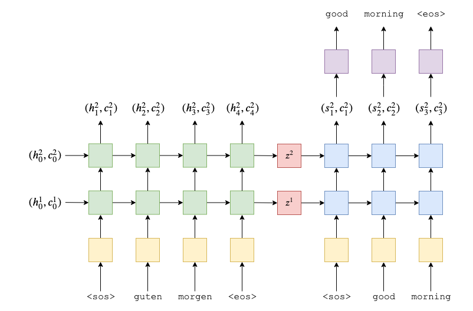

# Sequence to Sequence Model

## 结构：



```
1. Encoder 部分是一个双层单向LSTM，输入为 src=[batch size, src len]，经过 Embedding 转换为 [batch size, src len, emb dim]，经过 encoder LSTM，输出为所有时刻的隐状态 outputs=[batch size, src len, enc hid dim * 1] + 最后一个时刻的隐状态 hidden=[2 * 1, batch size, enc hid dim] + 最后一个时刻的 cell state=[2 * 1, batch size, enc hid dim]。hidden 和 cell state 作为 Decoder 的初始输入。

2. Decoder 是一个双层单向LSTM，每个时刻接收 inputs=[batch size, 1] + Decoder 上一个时刻的隐状态 hidden + Decoder 上一个时刻的 cell state，inputs 经过 embedding 转换为 embedded=[batch size, 1, emb dim]，将 embedded 和 Decoder 上一个时刻的 hidden 以及 cell state 一起传入 Decoder LSTM，得到 output=[batch size, 1, dec hid dim] 和当前时刻的 hidden=[2 * 1, batch size, dec hid dim] 以及当前时刻的 cell state=[2 * 1, batch size, dec hid dim], output 经过线性变换后得到该时刻的预测 [batch size, vocab size]，hidden 和 cell state 则继续作为 Decoder 下一个时刻的输入。
```

```
- 真实序列与预测序列之间的关系:
1. 传入 Decoder 的第一个输入为起始符<sos>，预测值填充到输出序列的第二个位置(index=1)，以此类推，输出序列的第一个位置(index=0)恒为0。真实序列与输出序列如下所示：
- trg = [<sos>, y1, y2, y3, <eos>]
- outputs = [0, y1', y2', y3', <eos>]
2. 计算损失的时候，将 trg 与 outputs 的第一个元素剔除，得到如下所示：
- trg = [ y1, y2, y3, <eos>]
- outputs = [y1', y2', y3', <eos>]
```

## Reference
- https://github.com/bentrevett/pytorch-seq2seq/blob/master/1%20-%20Sequence%20to%20Sequence%20Learning%20with%20Neural%20Networks.ipynb
