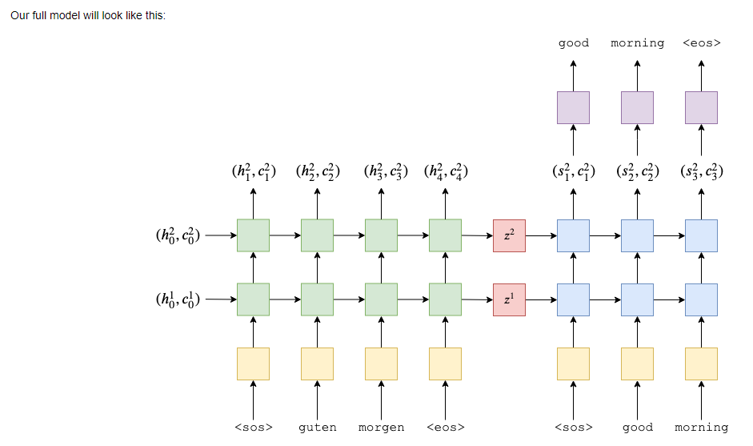

# Sequence to Sequence Model

## 结构：

- Encoder 部分是一个双层单向LSTM，输入为 src=[batch size, src len]，经过 Embedding 转换为 [batch size, src len, emb dim]，经过 encoder LSTM，输出为所有时刻的隐状态 outputs=[batch size, src len, enc hid dim * 2] + 最后一个时刻的隐状态 hidden=[2 * 1, batch size, enc hid dim] + 最后一个时刻的 cell state=[2 * 1, batch size, enc hid dim]。

- Decoder 是一个双层单向LSTM，每个时刻接收 inputs=[batch size, 1] + 解码器上一个时刻的隐状态 hidden + 解码器上一个时刻的 cell state，inputs 经过 embedding 转换为 embedded=[batch size, 1, emb dim]，将 embedded 和解码器上一个时刻的 hidden 以及 cell state 一起传入 decoder LSTM，得到 output=[batch size, 1, dec hid dim] 和当前时刻的 hidden=[2 * 1, batch size, dec hid dim] 以及当前时刻的 cell state=[2 * 1, batch size, dec hid dim], output 经过线性变换后得到该时刻的输出 [batch size, output dim]，hidden 和 cell state 则继续作为解码器下一个时刻的输入。

- Seq2seq:

## Reference
- https://github.com/bentrevett/pytorch-seq2seq/blob/master/1%20-%20Sequence%20to%20Sequence%20Learning%20with%20Neural%20Networks.ipynb
