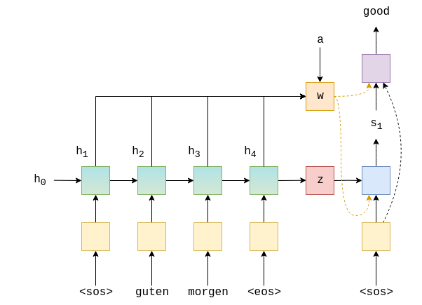
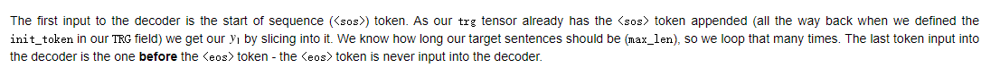
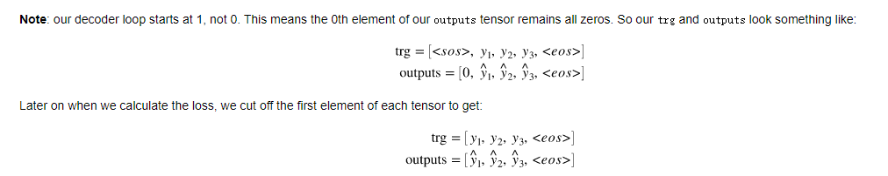

# Sequence to Sequence Model with Attention

## 结构：

- Encoder 部分是一个单层双向RNN，输入为 src=[batch size, src len]，经过 Embedding 转换为 [batch size, src len, emb dim]，
经过 Encoder RNN，输出所有时刻的隐状态 encoder_outputs=[batch size, src len, enc hid dim * 2] + 最后一个时刻的隐状态 hidden=[1 * 2, batch size, enc hid dim]，hidden 经过线性变换为 [batch size, dec hid dim]，作为 Decoder 的初始输入。

- Attention 将 Decoder 上一个时刻的最后隐状态 hidden=[batch size, dec hid dim] 和 Encoder 所有时刻的隐状态 encoder_outputs=[batch size, src len, enc hid dim * 2]，进行拼接，然后接一个激活函数为tanh的全连接层，然后在与一个网络定义的权重矩阵做乘积，输出 attention=[batch size, src len]。

- Decoder 是一个单层单向RNN，每个时刻接收: 
(1). inputs=[batch size, 1]，经过 Embedding层 转换为 embedded=[batch size, 1, emb dim]; 
(2). Decoder 上一个时刻的最后隐状态 hidden 和 Encoder 所有时刻的隐状态 encoder_outputs，两者经过运算得到 attention 值后，再与 encoder_outputs 相乘得到此时刻 encoder_outputs 的加权平均即 weighted。
将当前 weighted 和 embedded 拼接起来与Decoder 上一个时刻的最后隐状态 hidden 一起传入 Decoder RNN，得到 output=[batch size, 1, dec hid dim] 和 hidden=[1, batch size, dec hid dim]，output 和 weighted 以及 embedded 三者拼接起来经过线性变换后得到该时刻的预测 [batch size, vocab_size]，新的 hidden 则继续作为 Decoder 下一个时刻的输入。

- 真实序列与预测序列之间的关系:

## Reference
- https://github.com/bentrevett/pytorch-seq2seq/blob/master/3%20-%20Neural%20Machine%20Translation%20by%20Jointly%20Learning%20to%20Align%20and%20Translate.ipynb
- https://jalammar.github.io/visualizing-neural-machine-translation-mechanics-of-seq2seq-models-with-attention/
