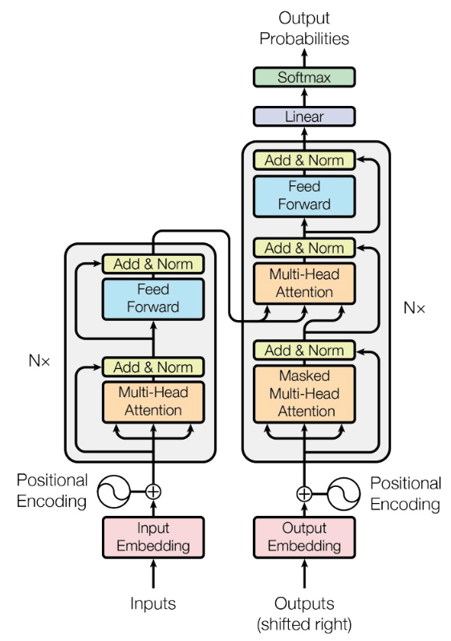

# Attention is All You Need



```
1.
- 真实序列为：:
trg = [<sos>, y1, y2, y3, <eos>]
- 传入模型的序列为：
trg = [<sos>, y1, y2, y3]
- 预测序列为：
outputs = [y1', y2', y3', <eos>]

2. 计算损失的时候，将 trg 的第一个元素剔除，得到如下所示：
- trg = [ y1, y2, y3, <eos>]
- outputs = [y1', y2', y3', <eos>]
```

## Reference
- https://github.com/bentrevett/pytorch-seq2seq/blob/master/6%20-%20Attention%20is%20All%20You%20Need.ipynb
