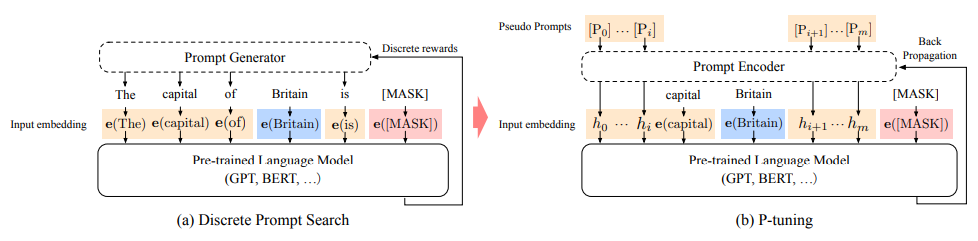

# GPT Understands, Too

## Structure

## Reference
- https://github.com/THUDM/P-tuning/tree/main/LAMA
- https://arxiv.org/pdf/2103.10385.pdf

## Usage
- train.jsonl: 部分训练样本数据，其中，obj_label和sub_label为临近的国家或城市，需构建带有obj_label的模板预测sub_label
- load_data.py: 构造训练数据
- construct_query_label_demo.py：假设，template的size为(2,2,2)， 则：
query的格式为 [cls_token_id, pseudo_token_id_1, pseudo_token_id_2, mask_token_id, pseudo_token_id_3, pseudo_token_id_4, obj_label_token_id, pseudo_token_id_5, pseudo_token_id_6, sep_token_id]
pseudo_token_id_x 的 embedding 需要通过额外训练的 prompt encoder 获得，而cls_token_id，mask_token_id，obj_label_token_id，sep_token_id 的 embedding 则通过 BertForMaskedLM 预训练模型的 embedding layer 获得。

label的格式为 [-100, -100, -100,  xxx, -100, -100, -100, -100, -100, -100]，其中xxx为 sub_label 对应的 token id
- prompt_encoder.py: LSTM+MLP， 通过训练获取 pseudo_token_id_x 的 embedding
- model.py: 模型文件
- train.py: 训练脚本
