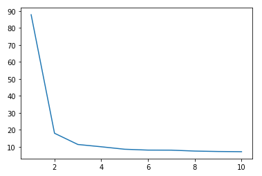

# Relation-Extraction
中文关系抽取

### 数据集来源：
http://ai.baidu.com/broad/download?dataset=sked

### bert_model
从 https://huggingface.co/models 下载bert-base-chinese模型，解压在pretrained_models下

bert-base-chinese目录结构如下：
```
bert-base-chinese/
├── config.json
├── pytorch_model.bin
└── vocab.txt
```
### 模型结构
整体是由两个部分组成，首先BERT+CRF抽取Subject和Object，构成统一标签B-{SUB，OBJ，BOTH}，I-{SUB，OBJ，BOTH}以及O；然后重用bert的编码向量序列，借鉴R-BERT思路，将[CLS], Subject, Object的向量表征拼接在一起预测关系标签。

### 模型训练10个Epoch，每个Epoch里只抽取100个batch


### 模型预测效果：

run demo_eval.py

```
除演艺事业外，李冰冰热心公益，发起并亲自参与多项环保慈善活动，积极投身其中，身体力行担起了回馈社会的责任于02年出演《少年包青天》，进入大家视线
少年包青天 - 主演 - 李冰冰
-----------------预测结果----------------
Subject包含：{'少年包青天'}
Object包含：{'李冰冰'}
少年包青天 - 主演 - 李冰冰
=========================================
马志舟，1907年出生，陕西三原人，汉族，中国共产党，任红四团第一连连长，1933年逝世
马志舟 - 国籍 - 中国
马志舟 - 出生日期 - 1907年
马志舟 - 民族 - 汉族
马志舟 - 出生地 - 陕西三原
-----------------预测结果----------------
Subject包含：{'马志舟'}
Object包含：{'1907年', '汉族', '中国', '陕西三原'}
马志舟 - 出生日期 - 1907年
马志舟 - 民族 - 汉族
马志舟 - 国籍 - 中国
马志舟 - 出生地 - 陕西三原
=========================================
《冰山上的来客》是戴冰执导的军事悬疑谍战片，由王洛勇、于荣光、努尔比亚等主演
冰山上的来客 - 主演 - 努尔比亚
冰山上的来客 - 主演 - 王洛勇
冰山上的来客 - 导演 - 戴冰
冰山上的来客 - 主演 - 于荣光
-----------------预测结果----------------
Subject包含：{'冰山上的来客'}
Object包含：{'王洛勇', '戴冰', '于荣光', '努尔比亚'}
冰山上的来客 - 主演 - 王洛勇
冰山上的来客 - 导演 - 戴冰
冰山上的来客 - 主演 - 于荣光
冰山上的来客 - 主演 - 努尔比亚
=========================================
《小王子》是由神田武幸导演，松野达也、増冈弘、松尾佳子、たてかべ和也主演，1978年7月上映的电影
小王子 - 主演 - たてかべ和也
小王子 - 导演 - 神田武幸
小王子 - 主演 - 松尾佳子
-----------------预测结果----------------
Subject包含：{'小王子'}
Object包含：{'松尾佳子', '増冈弘', '1978年7月', '松野达也', 'たてかべ和也', '神田武幸'}
小王子 - 主演 - 松尾佳子
小王子 - 主演 - 増冈弘
小王子 - 上映时间 - 1978年7月
小王子 - 主演 - 松野达也
小王子 - 主演 - たてかべ和也
小王子 - 导演 - 神田武幸
=========================================
《下班抓紧谈恋爱》是万达影视传媒有限公司、上海强胜影视文化传媒有限公司联合出品的的都市情感剧，由万洋执导，朱雨辰、杜海涛、徐黄丽、杨淇等主演1
下班抓紧谈恋爱 - 导演 - 万洋
下班抓紧谈恋爱 - 主演 - 杜海涛
下班抓紧谈恋爱 - 主演 - 朱雨辰
下班抓紧谈恋爱 - 出品公司 - 上海强胜影视
下班抓紧谈恋爱 - 出品公司 - 万达影视传媒
下班抓紧谈恋爱 - 主演 - 杨淇
下班抓紧谈恋爱 - 主演 - 徐黄丽
-----------------预测结果----------------
Subject包含：{'下班抓紧谈恋爱'}
Object包含：{'徐黄丽', '杨淇', '万达影视传媒有限公司', '万洋', '杜海涛', '朱雨辰', '上海强胜影视文化传媒'}
下班抓紧谈恋爱 - 主演 - 徐黄丽
下班抓紧谈恋爱 - 主演 - 杨淇
下班抓紧谈恋爱 - 出品公司 - 万达影视传媒有限公司
下班抓紧谈恋爱 - 导演 - 万洋
下班抓紧谈恋爱 - 主演 - 杜海涛
下班抓紧谈恋爱 - 主演 - 朱雨辰
下班抓紧谈恋爱 - 出品公司 - 上海强胜影视文化传媒
=========================================
贺捷生，1935年11月1日生，贺龙同志的女儿，湖南省桑植县人，中国人民解放军少将，军事科学院军事百科研究部部长，军旅作家
贺捷生 - 国籍 - 中国
贺捷生 - 出生日期 - 1935年11月1日
贺捷生 - 父亲 - 贺龙
贺捷生 - 出生地 - 湖南省桑植县
-----------------预测结果----------------
Subject包含：{'贺捷生'}
Object包含：{'1935年11月1日', '湖南省桑植县', '中国'}
贺捷生 - 出生日期 - 1935年11月1日
贺捷生 - 出生地 - 湖南省桑植县
贺捷生 - 国籍 - 中国
```

参考：

https://github.com/Jacen789/relation-extraction