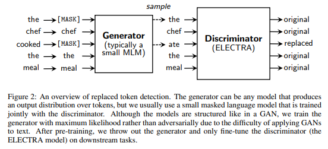
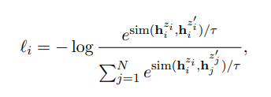
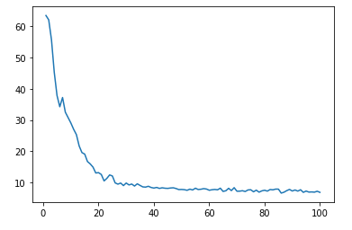

# Pretrained-Language-Model
中文预训练模型

### 模型结构
ELECTRA + SimCSE

1. ELECTRA的训练方式


ELECTRA的生成器跟判别器是两个不同的模型，但是共享token embedding。生成器可以是任何能够生成输出token概率分布的模型，生成器这里会充当一个MLM语言模型，建议参数量是判别器的1/4-1/2，原始文本进入生成器，会随机选择一部分token被替换为[Mask],然后用生成器预测对应[Mask]位置上的输出。所以生成器这里主要是去训练如何预测被mask掉的token的能力。ELECTRA的判别器是一个预训练模型，它会对生成器的所有token被进行判别，判别该token是生成器生成的,还是真实文本的。

2. SimCSE无监督训练任务


正样本是同一个文本输进去Bert两次得到的两个句向量（训练过程由于Bert中dropout层的随机性，Bert对同一个文本编码多次会得到不同的句向量）。负样本是一个文本跟同一个batch里的其他负样本得到的句向量。 优化的目标函数就是对比学习基本的损失函数，简单理解就是希望正样本之间的距离尽可能接近，负样本之间的距离尽可能疏远。

从 https://huggingface.co/models 下载bert-base-chinese模型

bert-base-chinese目录结构如下：

```
bert-base-chinese/
├── config.json
├── pytorch_model.bin
└── vocab.txt
└── config_gen.json (generator配置文件)
```

### toy data上的训练曲线


参考：
- 1). https://arxiv.org/pdf/2003.10555.pdf
- 2). https://arxiv.org/pdf/2104.08821.pdf