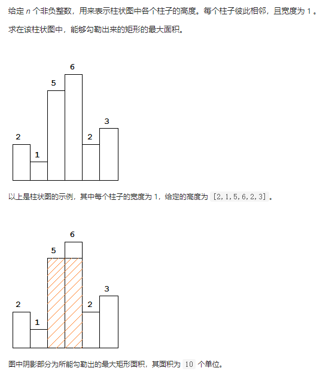

### 1.每日温度

请根据每日气温列表，重新生成一个列表。对应位置的输出为：要想观测到更高的气温，至少需要等待的天数。如果气温在这之后都不会升高，请在该位置用 0 来代替。

例如，给定一个列表 temperatures = [73, 74, 75, 71, 69, 72, 76, 73]，输出应该是 [1, 1, 4, 2, 1, 1, 0, 0]。

思路：递减栈，遍历整个数组，如果栈不空，且当前数字大于栈顶元素，取出栈顶元素，直接求出下标差就是二者的距离，继续看新的栈顶元素，直到当前数字小于等于栈顶元素停止，然后将数字对应下标入栈，

时间复杂度：O(n)

```
class Solution(object):
    def dailyTemperatures(self, temperatures):
        """
        :type temperatures: List[int]
        :rtype: List[int]
        """

        n = len(temperatures)
        res = [0]*n
        stack = []

        for i in range(n):
            while (stack and temperatures[i] > temperatures[stack[-1]]):
                ind = stack.pop()
                res[ind] = i - ind
            stack.append(i)
        return res
```

### 2.柱状图中最大的矩形

思路：采用递增栈+哨兵技巧，分别找到以第i根柱子为最矮柱子所能延伸的最大面积，即以 i 为中心，向左找第一个小于 heights[i] 的位置 left_i；向右找第一个小于 heights[i] 的位置 right_i，最大面积为 heights[i] * (right_i - left_i -1)。



Ref：https://leetcode-cn.com/problems/largest-rectangle-in-histogram/

```
class Solution(object):
    def largestRectangleArea(self, heights):
        """
        :type heights: List[int]
        :rtype: int
        """

        heights = [0] + heights + [0]
        stack = []
        res = 0

        for i in range(len(heights)):
            while (stack and heights[stack[-1]] > heights[i]):
                tmp = stack.pop()
                res = max(res, (i-stack[-1]-1)*heights[tmp]) 
            stack.append(i)
        return res
```

### 2.滑动窗口最大值

一个整数数组 nums，有一个大小为 k 的滑动窗口从数组的最左侧移动到数组的最右侧。滑动窗口每次只向右移动一位，返回滑动窗口中的最大值。

输入：nums = [1,3,-1,-3,5,3,6,7], k = 3

输出：[3,3,5,5,6,7]

思路：递减队列

```
class Solution(object):
    def maxSlidingWindow(self, nums, k):
        """
        :type nums: List[int]
        :type k: int
        :rtype: List[int]
        """

        res = []
        queue = []
        n = len(nums)
        for i in range(n):
            while (queue and nums[i] > nums[queue[-1]]):
                queue.pop() 
            queue.append(i)
            
            if i - queue[0] >= k:
                queue.pop(0)

            if i >= k-1:
                res.append(nums[queue[0]])

        return res
```

### 3.有效的括号

给定一个只包括 '('，')'，'{'，'}'，'['，']' 的字符串 s ，判断字符串是否有效。

思路：栈

```
class Solution:
    def isValid(self, s: str) -> bool:
        dic = {'{': '}',  '[': ']', '(': ')', '?': '?'}
        stack = ['?']
        for c in s:
            if c in dic: stack.append(c)
            elif dic[stack.pop()] != c: return False 
        return len(stack) == 1
```

### 4.字符串解码

输入：s = "3[a]2[bc]"
输出："aaabcbc"

思路：栈

```
class Solution(object):
    def decodeString(self, s):
        """
        :type s: str
        :rtype: str
        """
        stack=[]
        res = ''
        multi = 0

        for c in s:
            if '0' <= c <= '9':
                multi = 10*multi+int(c)
            elif c == '[':
                stack.append((res, multi))
                res = ''
                multi = 0
            elif c == ']':
                last_res, last_multi = stack.pop()
                res = last_res+res*last_multi
            else:
                res += c
        return res 
```

### 5.前 K 个高频元素

给你一个整数数组 nums 和一个整数 k ，请你返回其中出现频率前 k 高的元素。你可以按 任意顺序 返回答案。

输入: nums = [1,1,1,2,2,3], k = 2
输出: [1,2]

思路: 维护一个size=k的小顶堆

```
import heapq
import collections
class Solution(object):
    def topKFrequent(self, nums, k):
        """
        :type nums: List[int]
        :type k: int
        :rtype: List[int]
        """
        count = collections.Counter(nums)
        heap = []
        for key, val in count.items():
            if len(heap) >= k:
                if val > heap[0][0]:
                    heapq.heapreplace(heap, (val, key))
            else:
                heapq.heappush(heap, (val, key))
        return [item[1] for item in heap]
```

### 6.数组中的第K个最大元素

在未排序的数组中找到第 k 个最大的元素。请注意，你需要找的是数组排序后的第 k 个最大的元素，而不是第 k 个不同的元素。

输入: [3,2,1,5,6,4] 和 k = 2
输出: 5

思路1: 维护一个size=k的小顶堆

```
def findKthLargest(nums: List[int], k: int) -> int:
    size = len(nums)
    if k > size:
        raise Exception('程序出错')

    L = []
    for index in range(k):
        # heapq 默认就是小顶堆
        heapq.heappush(L, nums[index])

    for index in range(k, size):
        top = L[0]
        if nums[index] > top:
            # 看一看堆顶的元素，只要比堆顶元素大，就替换堆顶元素
            heapq.heapreplace(L, nums[index])
    # 最后堆顶中的元素就是堆中最小的，整个数组中的第 k 大元素
    return L[0]
```

思路2: 快排partition

```
class Solution(object):

    def partition(self, nums, left, right):
        i = left
        pivot = nums[right]
        for j in range(left, right+1):
            if nums[j] < pivot:
                nums[i],nums[j] = nums[j],nums[i]
                i += 1
        nums[i],nums[j] = nums[j],nums[i]
        return i

    def findKthLargest(self, nums, k):
        """
        :type nums: List[int]
        :type k: int
        :rtype: int
        """

        n = len(nums)
        left = 0
        right = n-1
        target = n-k

        while True:
            index = self.partition(nums, left, right)
            if index == target:
                return nums[index]
            elif index < target:
                left = index+1
            else:
                right = index-1
```