### 1.二叉树的中序遍历

给定一个二叉树的根节点 root ，返回它的 中序 遍历。

思路：栈，中序遍历：左，中，右，那么入栈顺序必须调整为倒序，也就是右，中，左

```
# Definition for a binary tree node.
# class TreeNode(object):
#     def __init__(self, val=0, left=None, right=None):
#         self.val = val
#         self.left = left
#         self.right = right
class Solution(object):
    def inorderTraversal(self, root):
        """
        :type root: TreeNode
        :rtype: List[int]
        """
        stack = [root]
        res = []
        while stack:
            i = stack.pop()
            if isinstance(i, TreeNode):
                stack.extend([i.right,i.val,i.left])
            elif isinstance(i, int):
                res.append(i)
        return res
```

### 1-1.二叉搜索树的第k大节点

给定一棵二叉搜索树，请找出其中第 k 大的节点的值。

思路：二叉搜索树的 中序遍历倒序 为 递减序列 

```
# Definition for a binary tree node.
# class TreeNode:
#     def __init__(self, x):
#         self.val = x
#         self.left = None
#         self.right = None

class Solution:
    def kthLargest(self, root: TreeNode, k: int) -> int:
        res = []
        stack=[root]
        while stack:
            i = stack.pop()
            if isinstance(i, TreeNode):
                stack.extend([i.left, i.val, i.right])
            elif isinstance(i, int):
                res.append(i)
                if len(res) == k:
                    break
        return res[-1]
```

### 2.验证二叉搜索树

给定一个二叉树，判断其是否是一个有效的二叉搜索树。

假设一个二叉搜索树具有如下特征：

节点的左子树只包含小于当前节点的数。
节点的右子树只包含大于当前节点的数。
所有左子树和右子树自身必须也是二叉搜索树。

思路：利用栈做中序遍历，得到递增的数列则为二叉搜索树

```
# Definition for a binary tree node.
# class TreeNode(object):
#     def __init__(self, val=0, left=None, right=None):
#         self.val = val
#         self.left = left
#         self.right = right
class Solution(object):
    def isValidBST(self, root):
        """
        :type root: TreeNode
        :rtype: bool
        """
        if not root:
            return False
        stack = [root]
        res = []

        while stack:
            i = stack.pop()
            if isinstance(i, TreeNode):
                stack.extend([i.right,i.val,i.left])
            if isinstance(i, int):
                if not res or (res and res[-1]<i):
                    res.append(i)
                else:
                    return False
        return True
```

### 3.二叉树的层序遍历

给你一个二叉树，请你返回其按 层序遍历 得到的节点值。 （即逐层地，从左到右访问所有节点）。

思路：队列 + BFS

```
# Definition for a binary tree node.
# class TreeNode(object):
#     def __init__(self, val=0, left=None, right=None):
#         self.val = val
#         self.left = left
#         self.right = right
class Solution(object):
    def levelOrder(self, root):
        """
        :type root: TreeNode
        :rtype: List[List[int]]
        """
        if not root:
            return []
            
        queue = [root]
        res = []

        while queue:
            n = len(queue)
            level = []
            for i in range(n):
                node = queue.pop(0)
                level.append(node.val)
                if node.left:
                    queue.append(node.left)
                if node.right:
                    queue.append(node.right)
            res.append(level)
        return res
```

### 4.对称二叉树

给定一个二叉树，检查它是否是镜像对称的。

```
class Solution(object):
	def isSymmetric(self, root):
		"""
		:type root: TreeNode
		:rtype: bool
		"""
		if not root or not (root.left or root.right):
			return True
		# 用队列保存节点	
		queue = [root.left,root.right]
		while queue:
		    # 从队列中取出两个节点，再比较这两个节点
		    left = queue.pop(0)
		    right = queue.pop(0)
		    # 如果两个节点都为空就继续循环，两者有一个为空就返回false
		    if not (left or right):
			continue
		    if not (left and right):
			return False
		    if left.val!=right.val:
			return False
		    # 将左节点的左孩子， 右节点的右孩子放入队列
		    queue.append(left.left)
		    queue.append(right.right)
		    # 将左节点的右孩子，右节点的左孩子放入队列
		    queue.append(left.right)
		    queue.append(right.left)
		return True
```

## 递归

### 1.什么样的问题可以用递归解决？

(1). 问题的解可以分解为几个子问题的解。何为子问题？就是数据规模更小的问题。 (2). 问题与子问题，除了数据规模不同，求解思路完全一样 (3). 存在递归终止条件

### 2.如何理解递归代码？

如果一个问题A可以分解为若干个子问题B、C、D，你可以假设子问题B、C、D已经解决。而且，你只需要思考问题A与子问题B、C、D两层之间的关系即可，不需要一层层往下思考子问题与子子问题，子子问题与子子子问题之间的关系。屏蔽掉递归细节，这样子理解起来就简单多了。
递归的一个非常重要的点就是：**不去管函数的内部细节是如何处理的，我们只看其函数作用以及输入与输出**。

### 1.二叉树的最大深度(递归)

二叉树的深度为根节点到最远叶子节点的最长路径上的节点数。

```
# Definition for a binary tree node.
# class TreeNode(object):
#     def __init__(self, val=0, left=None, right=None):
#         self.val = val
#         self.left = left
#         self.right = right
class Solution(object):
    def maxDepth(self, root):
        """
        :type root: TreeNode
        :rtype: int
        """
        if root is None: 
            return 0
			
	left_height = self.maxDepth(root.left) 
	right_height = self.maxDepth(root.right) 
	return max(left_height, right_height) + 1 
```

### 2.平衡二叉树 

输入一棵二叉树的根节点，判断该树是不是平衡二叉树。如果某二叉树中任意节点的左右子树的深度相差不超过1，那么它就是一棵平衡二叉树。

```
# Definition for a binary tree node.
# class TreeNode:
#     def __init__(self, x):
#         self.val = x
#         self.left = None
#         self.right = None

class Solution:
    def isBalanced(self, root: TreeNode) -> bool:
        
        def recur(root):
	    #构建递归：
	    #1).当节点root 左 / 右子树的深度差 ≤1 ：则返回当前子树的深度，即节点 root 的左 / 右子树的深度最大值 +1（ max(left, right) + 1 ）；
	    #2).当节点root 左 / 右子树的深度差 >=2 ：则返回 -1，代表 此子树不是平衡树 。
	    #终止条件：
	    #1).当 root 为空：说明越过叶节点，因此返回高度 0；
	    #2).当左（右）子树深度为 −1 ：代表此树的 左（右）子树 不是平衡树，因此剪枝，直接返回 −1 ；

	    if not root:
		return 0
	    left = recur(root.left)
	    if left == -1: return -1
	    right = recur(root.right)
	    if right == -1: return -1
	    return max(left, right) + 1 if abs(left-right)<=1 else -1

        return recur(root) != -1
```

### 3.从前序与中序遍历序列构造二叉树(递归)

根据一棵树的前序遍历与中序遍历构造二叉树。

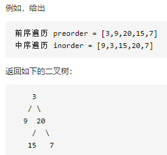

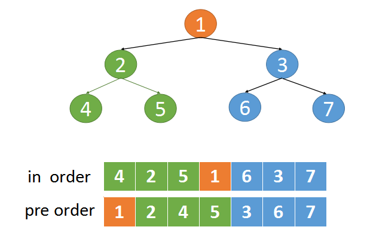

```
# Definition for a binary tree node.
# class TreeNode(object):
#     def __init__(self, val=0, left=None, right=None):
#         self.val = val
#         self.left = left
#         self.right = right
class Solution(object):
    def buildTree(self, preorder, inorder):
        """
        :type preorder: List[int]
        :type inorder: List[int]
        :rtype: TreeNode
        """
        if not (preorder and inorder):
	    return None
	# 根据前序数组的第一个元素，就可以确定根节点	
        root = TreeNode(preorder[0])
	# 用preorder[0]去中序数组中查找对应的元素
        mid_idx = inorder.index(preorder[0])
	# 递归的处理前序数组的左边部分和中序数组的左边部分
	# 递归处理前序数组右边部分和中序数组右边部分
        root.left = self.buildTree(preorder[1:mid_idx+1],inorder[:mid_idx])
        root.right = self.buildTree(preorder[mid_idx+1:],inorder[mid_idx+1:])
        return root
```

### 4.二叉树展开为链表(递归)

Ref：https://leetcode-cn.com/problems/flatten-binary-tree-to-linked-list/solution/114-er-cha-shu-zhan-kai-wei-lian-biao-by-ming-zhi-/

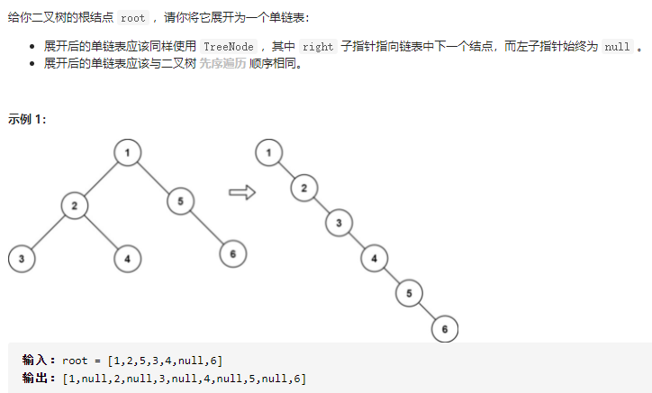

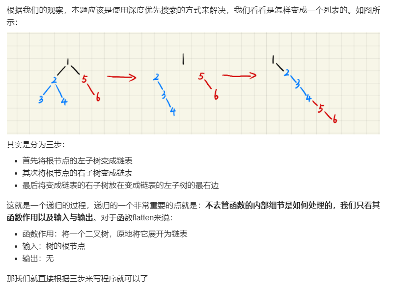

```
# Definition for a binary tree node.
# class TreeNode(object):
#     def __init__(self, val=0, left=None, right=None):
#         self.val = val
#         self.left = left
#         self.right = right
class Solution(object):
    def flatten(self, root):
        """
        :type root: TreeNode
        :rtype: None Do not return anything, modify root in-place instead.
        """

        if not root:
            return
        self.flatten(root.left)
        self.flatten(root.right)
        tmp = root.right
        root.right = root.left
        root.left = None
        while root.right:
            root = root.right
        root.right = tmp
```

### 5.合并二叉树(递归)


```
# Definition for a binary tree node.
# class TreeNode(object):
#     def __init__(self, val=0, left=None, right=None):
#         self.val = val
#         self.left = left
#         self.right = right
class Solution(object):
    def mergeTrees(self, root1, root2):
        """
        :type root1: TreeNode
        :type root2: TreeNode
        :rtype: TreeNode
        """
        if not root1:
            return root2

        if not root2:
            return root1

        merged = TreeNode(root1.val+root2.val)
        merged.left = self.mergeTrees(root1.left, root2.left)
        merged.right = self.mergeTrees(root1.right, root2.right)
        return merged 
```

### 6.二叉树的最近公共祖先(递归)

Ref：https://leetcode-cn.com/problems/lowest-common-ancestor-of-a-binary-tree/solution/c-jing-dian-di-gui-si-lu-fei-chang-hao-li-jie-shi-/

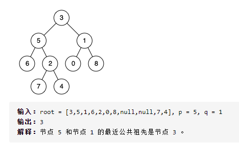

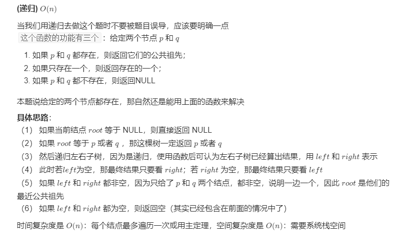

```
# Definition for a binary tree node.
# class TreeNode(object):
#     def __init__(self, x):
#         self.val = x
#         self.left = None
#         self.right = None

class Solution(object):
    def lowestCommonAncestor(self, root, p, q):
        """
        :type root: TreeNode
        :type p: TreeNode
        :type q: TreeNode
        :rtype: TreeNode
        """

        if not root:
            return None
        if (p==root) or (q==root):
            return root

        left = self.lowestCommonAncestor(root.left, p, q)
        right = self.lowestCommonAncestor(root.right, p, q)
        if not left:
            return right
        if not right:
            return left
        if left and right:
            return root
```

### 6-1.二叉搜索树的最近公共祖先

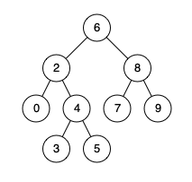

```
# Definition for a binary tree node.
# class TreeNode:
#     def __init__(self, x):
#         self.val = x
#         self.left = None
#         self.right = None

class Solution:
    def lowestCommonAncestor(self, root: 'TreeNode', p: 'TreeNode', q: 'TreeNode') -> 'TreeNode':
        if p.val < root.val and q.val < root.val:
            return self.lowestCommonAncestor(root.left, p, q)
        elif p.val > root.val and q.val > root.val:
            return self.lowestCommonAncestor(root.right, p, q)
        return root
```

### 7.翻转二叉树(递归)

Ref：https://leetcode-cn.com/problems/invert-binary-tree/solution/dong-hua-yan-shi-liang-chong-shi-xian-226-fan-zhua/

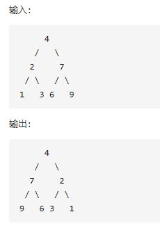

```
# Definition for a binary tree node.
# class TreeNode(object):
#     def __init__(self, val=0, left=None, right=None):
#         self.val = val
#         self.left = left
#         self.right = right
class Solution(object):
    def invertTree(self, root):
        """
        :type root: TreeNode
        :rtype: TreeNode
        """

        if not root:
            return None
        root.left = self.invertTree(root.left)
        root.right = self.invertTree(root.right)

        root.left, root.right = root.right, root.left
        return root
```

### 8.二叉树的直径(回溯+递归)

给定一棵二叉树，你需要计算它的直径长度。一棵二叉树的直径长度是任意两个结点路径长度中的最大值。这条路径可能穿过也可能不穿过根结点。

如图所示，二叉树的直径为8

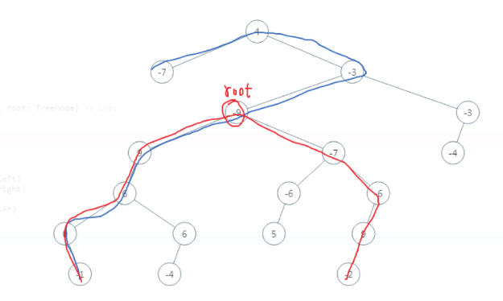

```
# Definition for a binary tree node.
# class TreeNode(object):
#     def __init__(self, val=0, left=None, right=None):
#         self.val = val
#         self.left = left
#         self.right = right
class Solution:
    def diameterOfBinaryTree(self, root):
        self.ans = 0
        def depth(node):
            # 访问到空节点了，返回0
            if not node:
                return 0
            # 左儿子为根的子树的深度
            L = depth(node.left)
            # 右儿子为根的子树的深度
            R = depth(node.right)
            # 计算d_node即L+R 并更新ans
            self.ans = max(self.ans, L + R)
            # 返回该节点为根的子树的深度
            return max(L, R) + 1

        depth(root)
        return self.ans
```

### 9.把二叉搜索树转换为累加树(回溯+递归)

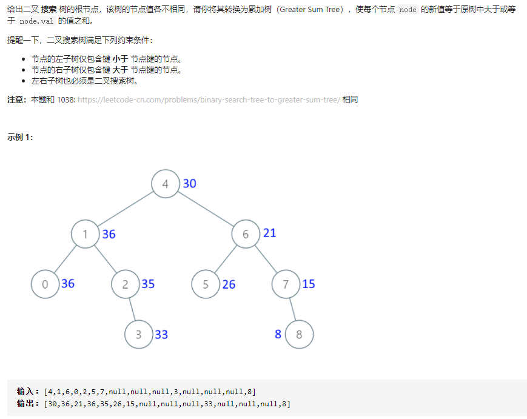

```
# Definition for a binary tree node.
# class TreeNode:
#     def __init__(self, val=0, left=None, right=None):
#         self.val = val
#         self.left = left
#         self.right = right
class Solution:
    def convertBST(self, root: TreeNode) -> TreeNode:
        def dfs(node: TreeNode):
            nonlocal total
            if not node:
                return
            dfs(node.right)
            total += node.val
            node.val = total
            dfs(node.left)
        
        total = 0
        dfs(root)
        return root
```

### 10.路径总和 III(回溯+递归+前缀和)

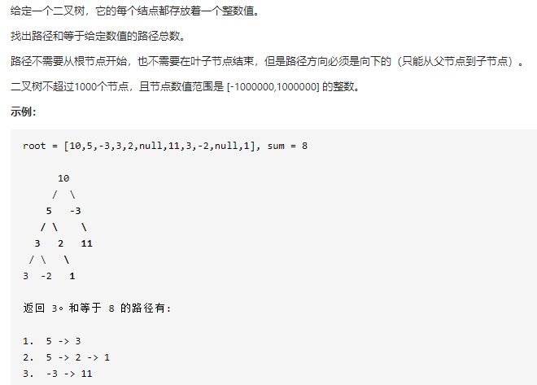

```
# Definition for a binary tree node.
# class TreeNode:
#     def __init__(self, val=0, left=None, right=None):
#         self.val = val
#         self.left = left
#         self.right = right
class Solution:
    def pathSum(self, root: TreeNode, sum: int) -> int:
  
        #思路：前缀和
        #递归进入左右子树后，回到当前层，要把当前节点添加的前缀和去除，避免回溯之后影响上一层。
    
        def dfs(node, hashmap, target, presum):
            #终止条件
            if not node:
                return 0
            #本层要做的事情
            cnt=0
            presum += node.val            
            cnt += hashmap.get(presum - target, 0)
            if presum not in hashmap:
                hashmap[presum] = 1
            else:
                hashmap[presum]+=1
            #进入下一层
            cnt+=dfs(node.left, hashmap, target, presum)
            cnt+=dfs(node.right, hashmap, target, presum)
            #！！！重要：回到本层 
            hashmap[presum]-=1
            return cnt

        hashmap = {0:1}
        r = dfs(root, hashmap, sum, 0)
        return r
```

### 11.打家劫舍 III(回溯+递归+动态规划)

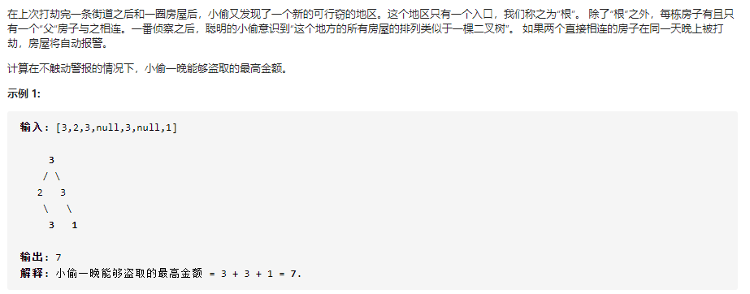

```
# Definition for a binary tree node.
# class TreeNode(object):
#     def __init__(self, val=0, left=None, right=None):
#         self.val = val
#         self.left = left
#         self.right = right
class Solution(object):
    def rob(self, root):
        """
        :type root: TreeNode
        :rtype: int
        """
        def dfs(node):
            if node is None:
                return [0,0]
            
            left = dfs(node.left)
            right = dfs(node.right)

            dp = [0, 0]
            #dp[0]表示以当前节点不偷状态下子树能够偷取的最大值,注意当前节点不偷的话，它的子树可以偷也可以不偷
            dp[0] = max(left[0], left[1]) + max(right[0], right[1])
            #dp[1]表示当前节点偷状态下子树能够偷取的最大值
            dp[1] = node.val + left[0] + right[0]
            return dp

        res = dfs(root)
        return max(res[0], res[1])
```

### 12.二叉搜索树的后序遍历序列


```
class Solution:
    def verifyPostorder(self, postorder: List[int]) -> bool:
        def recur(i, j):
            if i>=j:
                return True
            p = i
            while postorder[p] < postorder[j]:
                p+=1
            m=p
            while postorder[p] > postorder[j]:
                p+=1
            return p==j and recur(i, m-1) and recur(m, j-1)

        return recur(0, len(postorder)-1)
```