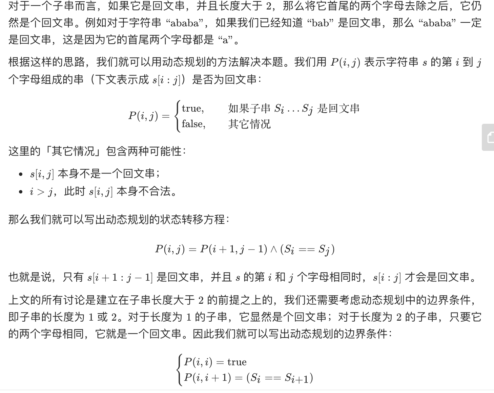
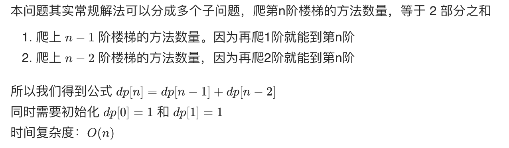
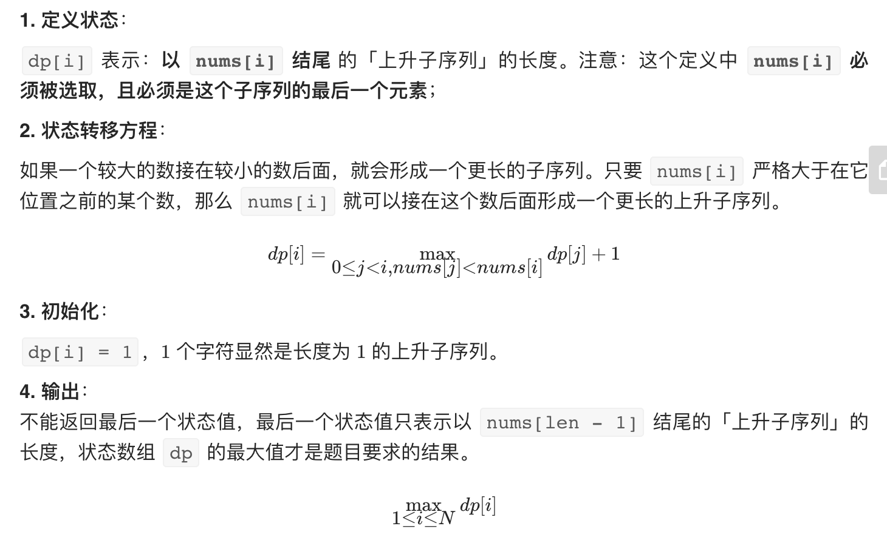
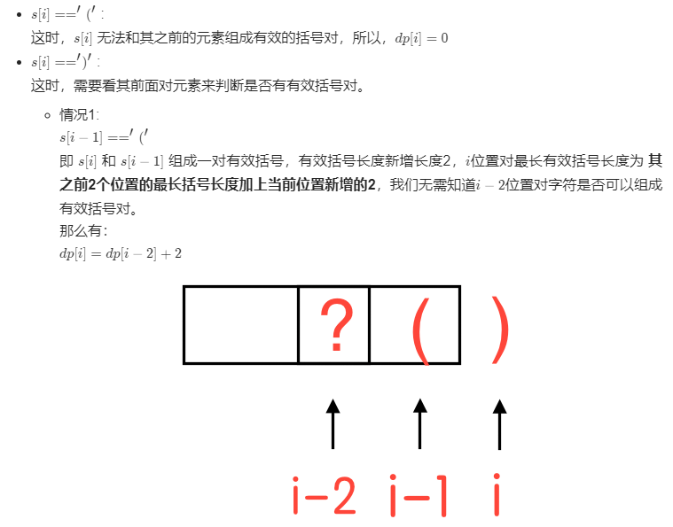
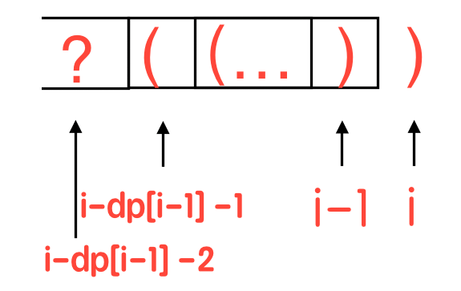
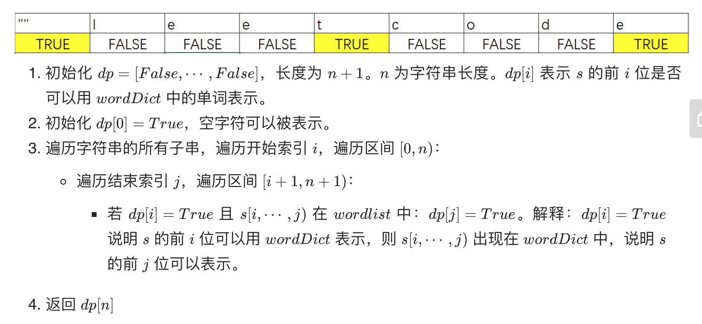
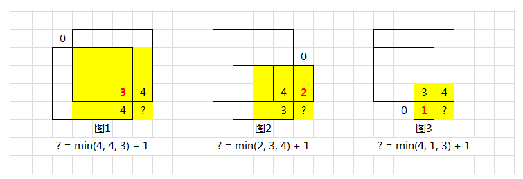
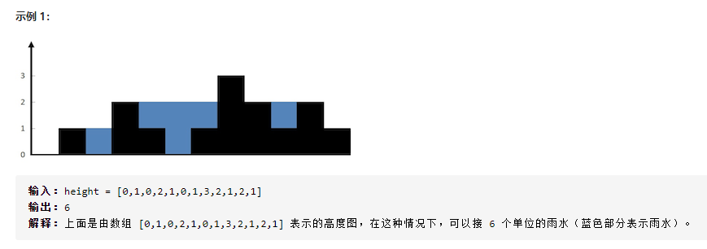
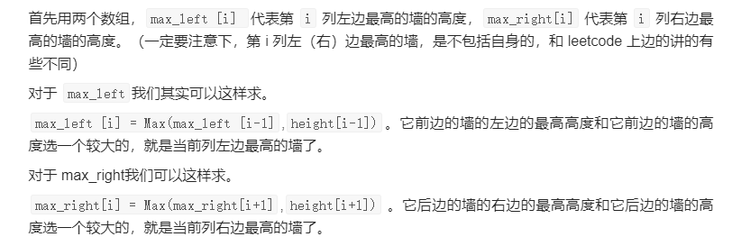

## 动态规划

**我们把问题分解为多个阶段，每个阶段对应一个决策。我们记录每一个阶段可达的状态集合（去掉重复的），然后通过当前阶段的状态集合，来推导下一个阶段的状态集合，动态地往前推进。**

解决动态规划问题，一般有两种思路，即**状态转移表法**和**状态转移方程法**。

状态转移表法: 我们先画出一个状态表。状态表一般都是二维的，所以你可以把它想象成二维数组。其中，每个状态包含三个变量，行、列、数组值。我们根据决策的先后过程，从前往后，根据递推关系，分阶段填充状态表中的每个状态。最后，我们将这个递推填表的过程，翻译成代码，就是动态规划代码了。

状态转移方程法: 类似递归的解题思路。我们需要分析，某个问题如何通过子问题来递归求解，写出递归公式，也就是所谓的状态转移方程。有了状态转移方程，代码实现就非常简单了。

### 1.背包问题

我们有一个背包，背包总的承载重量是 Wkg。现在我们有 n 个物品，每个物品的重量不等，并且不可分割。我们现在期望选择几件物品，装载到背包中。在不超过背包所能装载重量的前提下，如何让背包中物品的总重量最大？

我们把整个求解过程分为 n 个阶段，每个阶段会决策一个物品是否放到背包中。每个物品决策（放入或者不放入背包）完之后，背包中的物品的重量会有多种情况。

我们把每一层重复的状态（节点）合并，只记录不同的状态，然后基于上一层的状态集合，来推导下一层的状态集合。我们可以通过合并每一层重复的状态，这样就保证每一层不同状态的个数都不会超过 w 个（w 表示背包的承载重量）。
我们用一个二维数组 states[n][w+1]，来记录每层可以达到的不同状态。

第 0 个（下标从 0 开始编号）物品的重量是 2，要么装入背包，要么不装入背包，决策完之后，会对应背包的两种状态，背包中物品的总重量是 0 或者 2。我们用 states[0][0]=true 和 states[0][2]=true 来表示这两种状态。

第 1 个物品的重量也是 2，基于之前的背包状态，在这个物品决策完之后，不同的状态有 3 个，背包中物品总重量分别是 0(0+0)，2(0+2 or 2+0)，4(2+2)。我们用 states[1][0]=true，states[1][2]=true，states[1][4]=true 来表示这三种状态。

以此类推，直到考察完所有的物品后，整个 states 状态数组就都计算好了。图中 0 表示 false，1 表示 true。我们只需要在最后一层，找一个值为 true 的最接近 w（这里是 9）的值，就是背包中物品总重量的最大值。


```
def bag(capacity, items):
    n = len(items)  
    dp = [[-1]*(capacity+1) for _ in range(n)] #构造状态表
    dp[0][0] = 1 #填充第一行
    if items[0] <= capacity: #填充第一行
        dp[0][items[0]] = 1
        
    for i in range(1, n): #填充其他行
        for w in range(capacity+1):
            if dp[i-1][w] == 1:
                dp[i][w] = 1 #不放入背包
                if w + items[i] <= capacity: #放入背包
                    dp[i][w+items[i]] = 1
                    
    for w in range(capacity, -1, -1): #找出最大值
        if dp[-1][w] == 1:
            return w
```

### 2.最短距离问题

假设我们有一个 n 乘以 n 的矩阵 w[n][n]。矩阵存储的都是正整数。棋子起始位置在左上角，终止位置在右下角。我们将棋子从左上角移动到右下角。每次只能向右或者向下移动一位。从左上角到右下角，会有很多不同的路径可以走。我们把每条路径经过的数字加起来看作路径的长度。那从左上角移动到右下角的最短路径长度是多少呢？

画出一个二维状态表，表中的行、列表示棋子所在的位置，表中的数值表示从起点到这个位置的最短路径。我们按照决策过程，通过不断状态递推演进，将状态表填好。


```
def min_dist(w):
    m = len(w)
    n = len(w[0])    
    dp = [[None]*n for _ in range(m)] #构造状态表
    
    sum_ = 0
    for j in range(n): #填充第一行
        sum_ += w[0][j]
        dp[0][j] = sum_
        
    sum_ = 0
    for i in range(m): #填充第一列
        sum_ += w[i][0]
        dp[i][0] = sum_        
        
    for i in range(1, m): #填充其他单元格
        for j in range(1, n):
            dp[i][j] = w[i][j] + min(dp[i][j-1], dp[i-1][j])

    return dp[-1][-1] #返回最小值
```

### 3.编辑距离

编辑距离指的就是，将一个字符串转化成另一个字符串，需要的最少编辑操作次数（比如增加一个字符、删除一个字符、替换一个字符）。编辑距离越大，说明两个字符串的相似程度越小；相反，编辑距离就越小，说明两个字符串的相似程度越大。对于两个完全相同的字符串来说，编辑距离就是 0。

```
def edit_dist(s, t):
    m = len(s)
    n = len(t)

    dp = [[0]*(n+1) for _ in range(m+1)]

    for j in range(n+1):
        dp[0][j] = j
    
    for i in range(m+1):
        dp[i][0] = i

    for i in range(1, m+1):
        for j in range(1, n+1):
            if s[i-1] == t[j-1]:
                dp[i][j] = dp[i-1][j-1]
            else:
                dp[i][j] = min(dp[i-1][j], dp[i][j-1], dp[i-1][j-1]) + 1
        
    return dp[-1][-1]

print(edit_dist('intention', 'execution'))
```

### 4.最长公共子序列

```
def longestCommonSubsequence(s, t):
    m = len(s)
    n = len(t)
    dp = [[0]*(n+1) for _ in range(m+1)]
    states = [[None]*(n+1) for _ in range(m+1)]
    
    for i in range(1, m+1):
        for j in range(1, n+1):
            if s[i-1] == t[j-1]:
                dp[i][j] = dp[i-1][j-1]+1
                states[i][j] = 'ok'
            elif dp[i-1][j] > dp[i][j-1]:
                dp[i][j] = dp[i-1][j]
                states[i][j] = 'up'
            else:
                dp[i][j] = dp[i][j-1]
                states[i][j] = 'left'
                
    res = []            
    while states[m][n]:
        if states[m][n] == 'ok':
            res.append(s[m-1])
            m -= 1
            n -= 1
        if states[m][n] == 'up':
            m -= 1
        if states[m][n] == 'left':
            n -= 1
    res.reverse()
    return ''.join(res), len(res)


print(longestCommonSubsequence('a8f67g','abdfg')) 
```

### 5.最长公共子串

```
def LongestCommonSubstring(s, t):
    m = len(s)
    n = len(t)
    dp = [[0]*(n+1) for _ in range(m+1)]
    max_len = 0
    p = 0
   
    for i in range(1, m+1):
        for j in range(1, n+1):
            if s[i-1] == t[j-1]:
                dp[i][j] = dp[i-1][j-1]+1
                if dp[i][j] > max_len:
                    max_len = dp[i][j]
                    p = i
    return s[p-max_len:p], max_len
                
            
            
print(LongestCommonSubstring('abcdfg','abdfg')) 
```

### 6.最长回文串



```
class Solution(object):
    def longestPalindrome(self, s):
        """
        :type s: str
        :rtype: str
        """

        n = len(s)
        dp = [[False] * n for _ in range(n)]
        ans = ''
        for span in range(n):
            for i in range(n):
                j = i + span
                if j >= len(s):
                    break
                if span == 0:
                    dp[i][j] = True
                elif span == 1:
                    dp[i][j] = (s[i] == s[j])
                else:
                    dp[i][j] = (dp[i+1][j-1] and s[i] == s[j])
                if dp[i][j] and span+1 > len(ans):
                    ans = s[i:j+1]
        return ans
```

### 7.最大子序和

给定一个整数数组 nums ，找到一个具有最大和的连续子数组（子数组最少包含一个元素），返回其最大和。

```
举例：
输入：nums = [-2,1,-3,4,-1,2,1,-5,4]
输出：6
解释：连续子数组 [4,-1,2,1] 的和最大，为 6 。

class Solution(object):
    def maxSubArray(self, nums):
        """
        :type nums: List[int]
        :rtype: int
        """
        n = len(nums)
        dp = [0]*n
        dp[0] = nums[0]

        for i in range(1, n):
            dp[i] = max(nums[i], dp[i-1]+nums[i])

        return max(dp) 
```

### 8.爬楼梯

假设你正在爬楼梯。需要 n 阶你才能到达楼顶。每次你可以爬 1 或 2 个台阶。你有多少种不同的方法可以爬到楼顶呢？



```
class Solution(object):
    def climbStairs(self, n):
        """
        :type n: int
        :rtype: int
        """

        dp = [0] * (n+1)
        dp[0] = 1
        dp[1] = 1
        for i in range(2, n+1):
            dp[i] = dp[i-1] + dp[i-2]
        return dp[n]
```

### 9.最长递增子序列

给你一个整数数组 nums ，找到其中最长严格递增子序列的长度。

子序列是由数组派生而来的序列，删除（或不删除）数组中的元素而不改变其余元素的顺序。例如，[3,6,2,7] 是数组 [0,3,1,6,2,2,7] 的子序列。

Ref: https://leetcode-cn.com/problems/longest-increasing-subsequence/solution/dong-tai-gui-hua-er-fen-cha-zhao-tan-xin-suan-fa-p/



```
class Solution(object):
    def lengthOfLIS(self, nums):
        """
        :type nums: List[int]
        :rtype: int
        """

        n = len(nums)
        dp = [1] * n

        for i in range(1, n):
            for j in range(i):
                if nums[j] < nums[i]:
                    dp[i] = max(dp[j]+1, dp[i])
        return max(dp)
```

### 10. 最长有效括号

给你一个只包含 '(' 和 ')' 的字符串，找出最长有效（格式正确且连续）括号子串的长度。

Ref: https://leetcode-cn.com/problems/longest-valid-parentheses/solution/dong-tai-gui-hua-si-lu-xiang-jie-c-by-zhanganan042/

首先，我们定义一个 dp数组，其中第 i 个元素表示以下标为 i 的字符结尾的最长有效子字符串的长度。分情况讨论：





```
输入：s = ")()())"
输出：4
解释：最长有效括号子串是 "()()"

class Solution(object):
    def longestValidParentheses(self, s):
        """
        :type s: str
        :rtype: int
        """
        n = len(s)
        if n == 0: return 0
        dp = [0] * n
        for i in range(1,n):
            if s[i] == ')':
                if s[i-1] == '(':
                    dp[i] = dp[i-2] + 2 if (i-2) >= 0 else 2
                else:
                    if (i-dp[i-1]-1) >= 0 and s[i-dp[i-1]-1] == '(':
                        dp[i] = dp[i-1] + 2
                        if (i-dp[i-1]-2) >= 0:
                            dp[i] = dp[i] + dp[i-dp[i-1]-2]
        return max(dp)

```

### 11.单词拆分

给定一个非空字符串 s 和一个包含非空单词的列表 wordDict，判定 s 是否可以被空格拆分为一个或多个在字典中出现的单词。

Ref: https://leetcode-cn.com/problems/word-break/solution/dong-tai-gui-hua-ji-yi-hua-hui-su-zhu-xing-jie-shi/



```
class Solution:
    def wordBreak(self, s: str, wordDict: List[str]) -> bool:       
        n=len(s)
        dp=[False]*(n+1)
        dp[0]=True
        for i in range(n):
            for j in range(i+1,n+1):
                if(dp[i] and (s[i:j] in wordDict)):
                    dp[j]=True
        return dp[-1]
```

### 12.最大正方形

在一个由 '0' 和 '1' 组成的二维矩阵内，找到只包含 '1' 的最大正方形，并返回其面积。

思路：dp(i, j) 代表 matrix(i - 1, j - 1) 为右下角的正方形的最大边长。

Ref：https://leetcode-cn.com/problems/maximal-square/solution/li-jie-san-zhe-qu-zui-xiao-1-by-lzhlyle/



```
class Solution(object):
    def maximalSquare(self, matrix):
        """
        :type matrix: List[List[str]]
        :rtype: int
        """

        m = len(matrix)
        n = len(matrix[0])

        dp = [[0]*(n+1) for _ in range(m+1)]
        max_area = 0
        for i in range(m):
            for j in range(n):
                if matrix[i][j] == '1':
                    dp[i+1][j+1] = min(dp[i][j+1], dp[i+1][j], dp[i][j]) + 1
                    max_area = max(max_area, dp[i+1][j+1]*dp[i+1][j+1])
        return max_area
```

### 13.目标和(转化为背包0-1问题)

给定一个非负整数数组，a1, a2, ..., an, 和一个目标数，S。现在你有两个符号 + 和 -。对于数组中的任意一个整数，你都可以从 + 或 -中选择一个符号添加在前面。返回可以使最终数组和为目标数 S 的所有添加符号的方法数。

Ref：https://www.jianshu.com/p/cf7f8cb1b413?utm_campaign=maleskine&utm_content=note&utm_medium=seo_notes&utm_source=recommendation

```
原问题等同于： 找到nums一个正子集和一个负子集，使得总和等于target
我们假设P是正子集，N是负子集 例如： 假设nums = [1, 2, 3, 4, 5]，target = 3，一个可能的解决方案是+1-2+3-4+5 = 3 这里正子集P = [1, 3, 5]和负子集N = [2, 4]
那么让我们看看如何将其转换为子集求和问题：
sum(P) - sum(N) = target
sum(P) + sum(N) + sum(P) - sum(N) = target + sum(P) + sum(N)
2 * sum(P) = target + sum(nums)
因此，原来的问题已转化为一个求子集的和问题： 找到nums的一个子集 P，使得sum(P) = (target + sum(nums)) / 2
请注意，上面的公式已经证明target + sum(nums)必须是偶数，否则输出为0

dp[ i ][ j ]定义为从数组nums中 0 - i 的元素进行取舍可以得到 j 的方法数量
```

```
class Solution(object):
    def findTargetSumWays(self, nums, target):
        """
        :type nums: List[int]
        :type target: int
        :rtype: int
        """
        sumAll = sum(nums)
        if target > sumAll or (target + sumAll) % 2:
            return 0
        target = (target + sumAll) // 2

        dp = [[0]*(target+1) for _ in range(len(nums))]
        dp[0][0] = 2 if nums[0] == 0 else 1

        for j in range(1, target+1):
            if j==nums[0]:
                dp[0][j] = 1
        

        for i in range(1, len(nums)):
            for j in range(target+1):
                if j-nums[i] >= 0:
                    dp[i][j] = dp[i-1][j]+dp[i-1][j-nums[i]]
                else:
                    dp[i][j] = dp[i-1][j]
        return dp[-1][-1]
```

### 14.完全平方数

给你一个整数 n ，返回和为 n 的完全平方数的最少数量。

思路：dp[i]代表和为 i 的完全平方数的最少数量 

Ref：https://leetcode-cn.com/problems/perfect-squares/solution/hua-jie-suan-fa-279-wan-quan-ping-fang-shu-by-guan/

```
class Solution(object):
    def numSquares(self, n):
        """
        :type n: int
        :rtype: int
        """

        dp=[0]*(n+1)
        for i in range(1,n+1):
            dp[i] = i
            j = 1
            while i-j*j>=0:
                dp[i] = min(dp[i],dp[i-j*j]+1)
                j+=1
        return dp[-1]
```

### 15.零钱兑换

给定不同面额的硬币 coins 和一个总金额 amount。编写一个函数来计算可以凑成总金额所需的最少的硬币个数。如果没有任何一种硬币组合能组成总金额，返回 -1。你可以认为每种硬币的数量是无限的。

思路：dp[i]代表凑成金额 i 所需最少的硬币个数。

```
class Solution(object):
    def coinChange(self, coins, amount):
        """
        :type coins: List[int]
        :type amount: int
        :rtype: int
        """

        dp = [float('inf')] * (amount + 1)
        dp[0] = 0

        for i in range(1, amount+1):
            for coin in coins:
                if (i-coin) >= 0:
                    dp[i] = min(dp[i], dp[i-coin]+1)
        return dp[-1] if dp[-1]!=float('inf') else -1 
```

### 16.分割等和子集(转化为背包0-1问题)

给你一个只包含正整数的非空数组 nums 。请你判断是否可以将这个数组分割成两个子集，使得两个子集的元素和相等。

输入：nums = [1,5,11,5]
输出：true
解释：数组可以分割成 [1, 5, 5] 和 [11] 。

```
class Solution(object):
    def canPartition(self, nums):
        """
        :type nums: List[int]
        :rtype: bool
        """
        n = len(nums)
        allsum = sum(nums)
        if allsum % 2 != 0:
            return False
        target = allsum/2
        dp = [[0]*(target+1) for _ in range(n)]

        dp[0][0] = 1
        for j in range(1,target+1):
            if j == nums[0]:
                dp[0][j] = 1

        for i in range(1,n):
            for j in range(target+1):
                if (j-nums[i]) >= 0:
                    dp[i][j] = dp[i-1][j]+dp[i-1][j-nums[i]]
                else:
                    dp[i][j] = dp[i-1][j]
        return True if dp[-1][-1] else False
```

### 17.打家劫舍

你是一个专业的小偷，计划偷窃沿街的房屋。每间房内都藏有一定的现金，影响你偷窃的唯一制约因素就是相邻的房屋装有相互连通的防盗系统，如果两间相邻的房屋在同一晚上被小偷闯入，系统会自动报警。

给定一个代表每个房屋存放金额的非负整数数组，计算你 不触动警报装置的情况下 ，一夜之内能够偷窃到的最高金额。

输入：[1,2,3,1]
输出：4
解释：偷窃 1 号房屋 (金额 = 1) ，然后偷窃 3 号房屋 (金额 = 3)。偷窃到的最高金额 = 1 + 3 = 4 。

思路：dp[i] 代表前 i 个房子在满足条件下的能偷窃到的最高金额。

不抢第 n 个房间，因此等于前 n-1 个房子的最高金额，即 dp[n] = dp[n-1]；
抢第 n 个房间，此时不能抢第 n-1 个房间；因此等于前 n-2 个房子的最高金额加上当前房间价值，即 dp[n] = dp[n-2] + num；

```
class Solution(object):
    def rob(self, nums):
        """
        :type nums: List[int]
        :rtype: int
        """

        n = len(nums)

        dp = [0]*(n+1)
        dp[1] = nums[0]

        for i in range(2, n+1):
            dp[i] = max(dp[i-1], dp[i-2]+nums[i-1])

        return max(dp)
```

### 18.最佳买卖股票时机含冷冻期

给定一个整数数组，其中第 i 个元素代表了第 i 天的股票价格 。​

设计一个算法计算出最大利润。在满足以下约束条件下，你可以尽可能地完成更多的交易（多次买卖一支股票）:

你不能同时参与多笔交易（你必须在再次购买前出售掉之前的股票）。
卖出股票后，你无法在第二天买入股票 (即冷冻期为 1 天)。

输入: [1,2,3,0,2]
输出: 3 
解释: 对应的交易状态为: [买入, 卖出, 冷冻期, 买入, 卖出]

```
class Solution(object):
    def maxProfit(self, prices):
        """
        :type prices: List[int]
        :rtype: int

        dp[i][0]:第i天不持有股票，且当天没卖出
        dp[i][1]:第i天不持有股票，因为当天卖出了
        dp[i][2]: 第i天持有股票
        状态转移：
        "0"状态下，要么是昨天就没有股票，要么是昨天有股票，但是卖出了：
        dp[i][0] = max(dp[i - 1][1], dp[i - 1][0])

        "1"状态下，有股票卖，显然是昨天手上持股，今天的状态只考虑卖出就行了：
        dp[i][1] = dp[i-1][2] + prices[i]

        "2"状态下，有股票，可能是当天卖的，且前一天不能是状态1，不然就是冷冻期，也可能是前一天就持股，当天不卖出：
        dp[i][2] = max(dp[i-1][0] - prices[i], dp[i-1][2]) 
        """
        if not prices:
            return 0
        dp = [[0, 0, 0] for i in range(len(prices))]
        dp[0] = [0, 0, -prices[0]]
        for i in range(1, len(prices)):
            dp[i][0] = max(dp[i - 1][1], dp[i - 1][0])
            dp[i][1] = dp[i - 1][2] + prices[i]
            dp[i][2] = max(dp[i - 1][0] - prices[i], dp[i - 1][2])
        return max(dp[-1])
```

### 19.买卖股票的最佳时机

给定一个数组 prices ，它的第 i 个元素 prices[i] 表示一支给定股票第 i 天的价格。

你只能选择某一天买入这只股票，并选择在未来的某一个不同的日子 卖出该股票。设计一个算法来计算你所能获取的最大利润。

返回你可以从这笔交易中获取的最大利润。如果你不能获取任何利润，返回 0 。

输入：[7,1,5,3,6,4]
输出：5
解释：在第 2 天（股票价格 = 1）的时候买入，在第 5 天（股票价格 = 6）的时候卖出，最大利润 = 6-1 = 5 。
     注意利润不能是 7-1 = 6, 因为卖出价格需要大于买入价格；同时，你不能在买入前卖出股票。

思路：dp[i]代表第i天之前，不包括当天的股票最低价格

```
class Solution(object):
    def maxProfit(self, prices):
        """
        :type prices: List[int]
        :rtype: int
        """

        n = len(prices)

        dp = [0]*n
        dp[0] = prices[0]
        profit = 0
        max_profit = 0

        for i in range(1,n):
            dp[i] = min(dp[i-1], prices[i-1])
            profit = prices[i] - dp[i]
            if profit > max_profit:
                max_profit = profit
        return max_profit
```

### 20.接雨水

给定 n 个非负整数表示每个宽度为 1 的柱子的高度图，计算按此排列的柱子，下雨之后能接多少雨水。





Ref：https://leetcode-cn.com/problems/trapping-rain-water/solution/xiang-xi-tong-su-de-si-lu-fen-xi-duo-jie-fa-by-w-8/

```
class Solution(object):
    def trap(self, height):
        """
        :type height: List[int]
        :rtype: int

        求每一列的水，我们只需要关注当前列，以及左边最高的墙，右边最高的墙
        1. 两边最高中的较矮的墙的高度大于当前列的墙的高度,其减去当前列的高度就可以了
        2. 两边最高中的较矮的墙的高度小于等于当前列的墙的高度,不会有水
        """

        n = len(height)

        max_left = [0]*n
        for i in range(1, n-1):
            max_left[i] = max(max_left[i-1], height[i-1])

        max_right = [0]*n
        for i in range(n-2, 0, -1):
            max_right[i] = max(max_right[i+1], height[i+1])

        sum_ = 0
        for i in range(1, n-1):
            h = min(max_left[i], max_right[i])
            if h > height[i]:
                sum_ += (h-height[i])
        return sum_
```