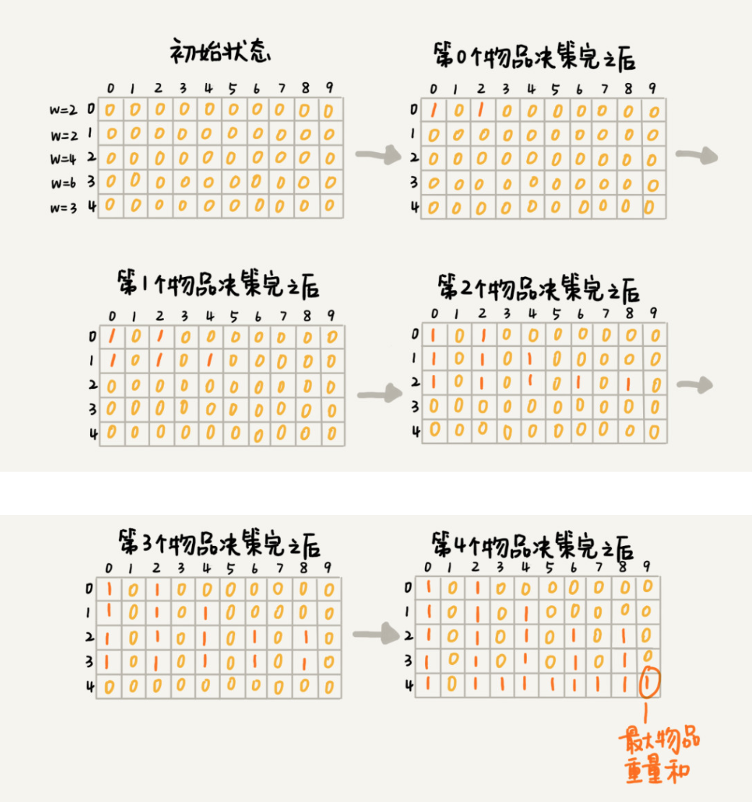
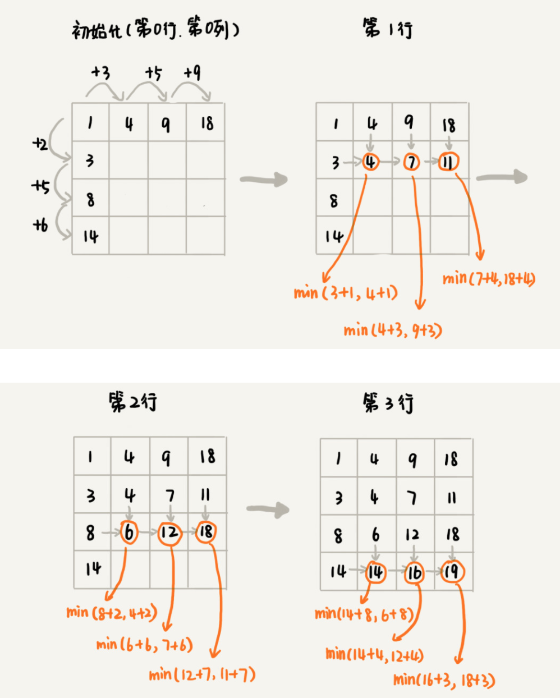

## 动态规划

**我们把问题分解为多个阶段，每个阶段对应一个决策。我们记录每一个阶段可达的状态集合（去掉重复的），然后通过当前阶段的状态集合，来推导下一个阶段的状态集合，动态地往前推进。**

解决动态规划问题，一般有两种思路，即**状态转移表法**和**状态转移方程法**。

状态转移表法: 我们先画出一个状态表。状态表一般都是二维的，所以你可以把它想象成二维数组。其中，每个状态包含三个变量，行、列、数组值。我们根据决策的先后过程，从前往后，根据递推关系，分阶段填充状态表中的每个状态。最后，我们将这个递推填表的过程，翻译成代码，就是动态规划代码了。

状态转移方程法: 类似递归的解题思路。我们需要分析，某个问题如何通过子问题来递归求解，写出递归公式，也就是所谓的状态转移方程。有了状态转移方程，代码实现就非常简单了。

### 1.背包问题

我们有一个背包，背包总的承载重量是 Wkg。现在我们有 n 个物品，每个物品的重量不等，并且不可分割。我们现在期望选择几件物品，装载到背包中。在不超过背包所能装载重量的前提下，如何让背包中物品的总重量最大？

我们把整个求解过程分为 n 个阶段，每个阶段会决策一个物品是否放到背包中。每个物品决策（放入或者不放入背包）完之后，背包中的物品的重量会有多种情况。

我们把每一层重复的状态（节点）合并，只记录不同的状态，然后基于上一层的状态集合，来推导下一层的状态集合。我们可以通过合并每一层重复的状态，这样就保证每一层不同状态的个数都不会超过 w 个（w 表示背包的承载重量）。
我们用一个二维数组 states[n][w+1]，来记录每层可以达到的不同状态。

第 0 个（下标从 0 开始编号）物品的重量是 2，要么装入背包，要么不装入背包，决策完之后，会对应背包的两种状态，背包中物品的总重量是 0 或者 2。我们用 states[0][0]=true 和 states[0][2]=true 来表示这两种状态。

第 1 个物品的重量也是 2，基于之前的背包状态，在这个物品决策完之后，不同的状态有 3 个，背包中物品总重量分别是 0(0+0)，2(0+2 or 2+0)，4(2+2)。我们用 states[1][0]=true，states[1][2]=true，states[1][4]=true 来表示这三种状态。

以此类推，直到考察完所有的物品后，整个 states 状态数组就都计算好了。图中 0 表示 false，1 表示 true。我们只需要在最后一层，找一个值为 true 的最接近 w（这里是 9）的值，就是背包中物品总重量的最大值。



```
def bag(capacity, items):
    n = len(items)  
    dp = [[-1]*(capacity+1) for _ in range(n)] #构造状态表
    dp[0][0] = 1 #填充第一行
    if items[0] <= capacity: #填充第一行
        dp[0][items[0]] = 1
        
    for i in range(1, n): #填充其他行
        for w in range(capacity+1):
            if dp[i-1][w] == 1:
                dp[i][w] = 1 #不放入背包
                if w + items[i] <= capacity: #放入背包
                    dp[i][w+items[i]] = 1
                    
    for w in range(capacity, -1, -1): #找出最大值
        if dp[-1][w] == 1:
            return w
```

### 2.最短距离问题

假设我们有一个 n 乘以 n 的矩阵 w[n][n]。矩阵存储的都是正整数。棋子起始位置在左上角，终止位置在右下角。我们将棋子从左上角移动到右下角。每次只能向右或者向下移动一位。从左上角到右下角，会有很多不同的路径可以走。我们把每条路径经过的数字加起来看作路径的长度。那从左上角移动到右下角的最短路径长度是多少呢？

画出一个二维状态表，表中的行、列表示棋子所在的位置，表中的数值表示从起点到这个位置的最短路径。我们按照决策过程，通过不断状态递推演进，将状态表填好。



```
def min_dist(w):
    m = len(w)
    n = len(w[0])    
    dp = [[None]*n for _ in range(m)] #构造状态表
    
    sum_ = 0
    for j in range(n): #填充第一行
        sum_ += w[0][j]
        dp[0][j] = sum_
        
    sum_ = 0
    for i in range(m): #填充第一列
        sum_ += w[i][0]
        dp[i][0] = sum_        
        
    for i in range(1, m): #填充其他单元格
        for j in range(1, n):
            dp[i][j] = w[i][j] + min(dp[i][j-1], dp[i-1][j])

    return dp[-1][-1] #返回最小值
```

### 3.编辑距离

编辑距离指的就是，将一个字符串转化成另一个字符串，需要的最少编辑操作次数（比如增加一个字符、删除一个字符、替换一个字符）。编辑距离越大，说明两个字符串的相似程度越小；相反，编辑距离就越小，说明两个字符串的相似程度越大。对于两个完全相同的字符串来说，编辑距离就是 0。

```
def edit_dist(s, t):
    m = len(s)
    n = len(t)

    dp = [[0]*(n+1) for _ in range(m+1)]

    for j in range(n+1):
        dp[0][j] = j
    
    for i in range(m+1):
        dp[i][0] = i

    for i in range(1, m+1):
        for j in range(1, n+1):
            if s[i-1] == t[j-1]:
                dp[i][j] = dp[i-1][j-1]
            else:
                dp[i][j] = min(dp[i-1][j], dp[i][j-1], dp[i-1][j-1]) + 1
        
    return dp[-1][-1]

print(edit_dist('intention', 'execution'))
```

### 4.最长公共子序列

```
def longestCommonSubsequence(s, t):
    m = len(s)
    n = len(t)
    dp = [[0]*(n+1) for _ in range(m+1)]
    states = [[None]*(n+1) for _ in range(m+1)]
    
    for i in range(1, m+1):
        for j in range(1, n+1):
            if s[i-1] == t[j-1]:
                dp[i][j] = dp[i-1][j-1]+1
                states[i][j] = 'ok'
            elif dp[i-1][j] > dp[i][j-1]:
                dp[i][j] = dp[i-1][j]
                states[i][j] = 'up'
            else:
                dp[i][j] = dp[i][j-1]
                states[i][j] = 'left'
                
    res = []            
    while states[m][n]:
        if states[m][n] == 'ok':
            res.append(s[m-1])
            m -= 1
            n -= 1
        if states[m][n] == 'up':
            m -= 1
        if states[m][n] == 'left':
            n -= 1
    res.reverse()
    return ''.join(res), len(res)


print(longestCommonSubsequence('a8f67g','abdfg')) 
```

### 5.最长公共子串

```
def LongestCommonSubstring(s, t):
    m = len(s)
    n = len(t)
    dp = [[0]*(n+1) for _ in range(m+1)]
    max_len = 0
    p = 0
   
    for i in range(1, m+1):
        for j in range(1, n+1):
            if s[i-1] == t[j-1]:
                dp[i][j] = dp[i-1][j-1]+1
                if dp[i][j] > max_len:
                    max_len = dp[i][j]
                    p = i
    return s[p-max_len:p], max_len
                
            
            
print(LongestCommonSubstring('abcdfg','abdfg')) 
```

### 6.最长回文串

```
class Solution(object):
    def longestPalindrome(self, s):
        """
        :type s: str
        :rtype: str
        """

        n = len(s)
        dp = [[False] * n for _ in range(n)]
        ans = ''
        for span in range(n):
            for i in range(n):
                j = i + span
                if j >= len(s):
                    break
                if span == 0:
                    dp[i][j] = True
                elif span == 1:
                    dp[i][j] = (s[i] == s[j])
                else:
                    dp[i][j] = (dp[i+1][j-1] and s[i] == s[j])
                if dp[i][j] and span+1 > len(ans):
                    ans = s[i:j+1]
        return ans
```

### 7.最大子序和

给定一个整数数组 nums ，找到一个具有最大和的连续子数组（子数组最少包含一个元素），返回其最大和。

```
举例：
输入：nums = [-2,1,-3,4,-1,2,1,-5,4]
输出：6
解释：连续子数组 [4,-1,2,1] 的和最大，为 6 。

class Solution(object):
    def maxSubArray(self, nums):
        """
        :type nums: List[int]
        :rtype: int
        """
        n = len(nums)
        dp = [0]*n
        dp[0] = nums[0]

        for i in range(1, n):
            dp[i] = max(nums[i], dp[i-1]+nums[i])

        return max(dp) 
```

### 8.爬楼梯

假设你正在爬楼梯。需要 n 阶你才能到达楼顶。每次你可以爬 1 或 2 个台阶。你有多少种不同的方法可以爬到楼顶呢？

```
class Solution(object):
    def climbStairs(self, n):
        """
        :type n: int
        :rtype: int
        """

        dp = [0] * (n+1)
        dp[0] = 1
        dp[1] = 1
        for i in range(2, n+1):
            dp[i] = dp[i-1] + dp[i-2]
        return dp[n]
```

### 9.最长递增子序列

给你一个整数数组 nums ，找到其中最长严格递增子序列的长度。

子序列是由数组派生而来的序列，删除（或不删除）数组中的元素而不改变其余元素的顺序。例如，[3,6,2,7] 是数组 [0,3,1,6,2,2,7] 的子序列。

```
class Solution(object):
    def lengthOfLIS(self, nums):
        """
        :type nums: List[int]
        :rtype: int
        """

        n = len(nums)
        dp = [1] * n

        for i in range(1, n):
            for j in range(i):
                if nums[j] < nums[i]:
                    dp[i] = max(dp[j]+1, dp[i])
        return max(dp)
```
