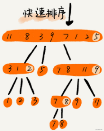
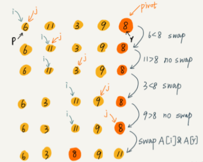
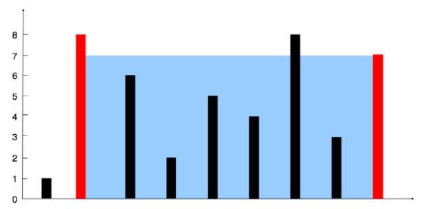

### 1.快速排序

快排的思想是这样的：如果要排序数组中下标从 p 到 r 之间的一组数据，我们选择 p 到 r 之间的任意一个数据作为 pivot（分区点）。我们遍历 p 到 r 之间的数据，将小于 pivot 的放到左边，将大于 pivot 的放到右边，将 pivot 放到中间。经过这一步骤之后，数组 p 到 r 之间的数据就被分成了三个部分，前面 p 到 q-1 之间都是小于 pivot 的，中间是 pivot，后面的 q+1 到 r 之间是大于 pivot 的。根据分治、递归的处理思想，我们可以用递归排序下标从 p 到 q-1 之间的数据和下标从 q+1 到 r 之间的数据，直到区间缩小为 1，就说明所有的数据都有序了。





时间复杂度：O(nlogn)

```
def quick_sort(array, l, r):
    if l < r:
        q = partition(array, l, r)
        quick_sort(array, l, q - 1)
        quick_sort(array, q + 1, r)
    return array
 
def partition(array, left_ind, right_ind):   
    pivot = array[right_ind]
    i = left_ind
    for j in range(left_ind, right_ind+1):
        if array[j] < pivot:
            array[i], array[j] = array[j], array[i]
            i += 1
    array[i], array[j] = array[j], array[i]
    return i
    
print(quick_sort([2,5,3,6,6,6], 0, 5))
```

### 2.移动零

给定一个数组 nums，编写一个函数将所有 0 移动到数组的末尾，同时保持非零元素的相对顺序。

思路：同样借助快排的思想解题

```
输入: [0,1,0,3,12]
输出: [1,3,12,0,0]

class Solution(object):
    def moveZeroes(self, nums):
        """
        :type nums: List[int]
        :rtype: None Do not return anything, modify nums in-place instead.
        """

        n = len(nums)
        i = 0
        for j in range(n):
            if nums[j]:
                nums[i], nums[j] = nums[j], nums[i]
                i += 1
        return nums
```

### 3.盛最多水的容器

给你 n 个非负整数 a1，a2，...，an，每个数代表坐标中的一个点 (i, ai) 。在坐标内画 n 条垂直线，垂直线 i 的两个端点分别为 (i, ai) 和 (i, 0) 。找出其中的两条线，使得它们与 x 轴共同构成的容器可以容纳最多的水。



输入：[1,8,6,2,5,4,8,3,7]

输出：49 

解释：图中垂直线代表输入数组 [1,8,6,2,5,4,8,3,7]。在此情况下，容器能够容纳水（表示为蓝色部分）的最大值为 49。

思路：设置双指针 i,j 分别位于容器壁两端，根据规则移动指针更新面积最大值，直到 i == j

```
class Solution(object):
    def maxArea(self, height):
        """
        :type height: List[int]
        :rtype: int
        """

        i = 0
        j = len(height)-1
        max_area = 0
        while i < j:
            if height[i] < height[j]:
                max_area = max(max_area, height[i]*(j-i))
                i += 1
            else:
                max_area = max(max_area, height[j]*(j-i))
                j -= 1
        return max_area
```

### 4.最短无序连续子数组

一个整数数组 nums ，找出一个 连续子数组 ，如果对这个子数组进行升序排序，那么整个数组都会变为升序排序。请找出符合题意的最短子数组，并输出它的长度。

思路：双指针分别从两端遍历两数组找第一次不同的位置

```
class Solution(object):
    def findUnsortedSubarray(self, nums):
        """
        :type nums: List[int]
        :rtype: int
        """
        n = len(nums)
        snums = sorted(nums)
        l = r = 0

        for i in range(n):
            if snums[i] != nums[i]:
                l = i
                break
        
        for i in range(n-1,-1,-1):
            if snums[i] != nums[i]:
                r = i
                break

        if r-l > 0:
            return r-l+1
        else:
            return 0
```
