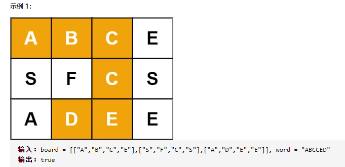
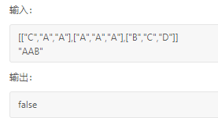
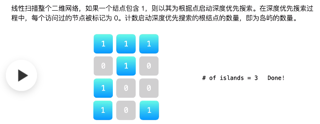

## 回溯算法

回溯的处理思想，有点类似枚举搜索。我们枚举所有的解，找到满足期望的解。为了**有规律地枚举**所有可能的解，避免遗漏和重复，我们把问题求解的过程分为多个阶段。每个阶段，我们都会面对一个岔路口，我们先随意选一条路走，当发现这条路走不通的时候（不符合期望的解），就回退到上一个岔路口，另选一种走法继续走。

### 1.背包问题

我们有一个背包，背包总的承载重量是 Wkg。现在我们有 n 个物品，每个物品的重量不等，并且不可分割。我们现在期望选择几件物品，装载到背包中。在不超过背包所能装载重量的前提下，如何让背包中物品的总重量最大？

这里就可以用回溯的方法。我们可以把物品依次排列，整个问题就分解为了 n 个阶段，每个阶段对应一个物品怎么选择。先对第一个物品进行处理，选择装进去或者不装进去，然后再递归地处理剩下的物品。

这里还稍微用到了一点**搜索剪枝**的技巧，就是当发现已经选择的物品的重量超过 Wkg 之后，我们就停止继续探测剩下的物品。

```
def bag(capacity, items):
    item_id = 0 #表示将要决策第几个物品是否装入背包
    cur_weight = 0 #当前背包中物品的总重量
    max_weight = 0 #最大重量，要优化的目标
    
    def dfs(item_id, cur_weight): #构造递归
        nonlocal max_weight
        if item_id >= len(items) or cur_weight == capacity: #递归终止
            if cur_weight > max_weight: #满足条件，更新要优化的目标
                max_weight = cur_weight
            return #终止标志
        
        if cur_weight + items[item_id] <= capacity: #情况1
            dfs(item_id+1, cur_weight + items[item_id])
        dfs(item_id+1, cur_weight) #情况2
        
    dfs(item_id, cur_weight) #调用递归
    return max_weight #返回要优化的目标
```

### 2.最短距离问题

假设我们有一个 n 乘以 n 的矩阵 w[n][n]。矩阵存储的都是正整数。棋子起始位置在左上角，终止位置在右下角。我们将棋子从左上角移动到右下角。每次只能向右或者向下移动一位。从左上角到右下角，会有很多不同的路径可以走。我们把每条路径经过的数字加起来看作路径的长度。那从左上角移动到右下角的最短路径长度是多少呢？

```
def min_dist(w):
    m = len(w) - 1
    n = len(w[0]) - 1
    i = 0 #当前行index
    j = 0 #当前列index
    cw = w[0][0] #当前weight
    min_w = float('inf') #最小weight,要优化的值
    
    def dfs(i, j, cw): #构造递归
        nonlocal min_w        
        if i == m and j== n: #递归终止
            if cw < min_w: #满足条件，更新要优化的目标
                min_w = cw
            return #终止标志       
        if i < m: #情况1
            dfs(i+1, j, cw+w[i+1][j])
        if j < n: #情况2
            dfs(i, j+1, cw+w[i][j+1])

    dfs(i, j, cw) #调用递归
    return min_w #返回要优化的目标

w = [[1, 3, 5, 9], [2, 1, 3, 4], [5, 2, 6, 7], [6, 8, 4, 3]]
print(min_dist(w))
```

### 3.编辑距离

编辑距离指的就是，将一个字符串转化成另一个字符串，需要的最少编辑操作次数（比如增加一个字符、删除一个字符、替换一个字符）。编辑距离越大，说明两个字符串的相似程度越小；相反，编辑距离就越小，说明两个字符串的相似程度越大。对于两个完全相同的字符串来说，编辑距离就是 0。

回溯是一个递归处理的过程。如果 a[i]与 b[j]匹配，我们递归考察 a[i+1]和 b[j+1]。如果 a[i]与 b[j]不匹配，那我们有多种处理方式可选：

(1). 可以删除 a[i]，然后递归考察 a[i+1]和 b[j]；

(2). 可以删除 b[j]，然后递归考察 a[i]和 b[j+1]；

(3). 可以在 a[i]前面添加一个跟 b[j]相同的字符，然后递归考察 a[i]和 b[j+1];

(4). 可以在 b[j]前面添加一个跟 a[i]相同的字符，然后递归考察 a[i+1]和 b[j]；

(5). 可以将 a[i]替换成 b[j]，或者将 b[j]替换成 a[i]，然后递归考察 a[i+1]和 b[j+1]。

```
def edit_dist(s, t):
    m = len(s)
    n = len(t)
    i = 0 #表示将要决策字符串s的第几个字符
    j = 0 #表示将要决策字符串t的第几个字符
    cur_dist = 0 #当前的编辑距离
    min_dist = float('inf') #最小编辑距离
    
    def dfs(i, j, cur_dist):
        nonlocal min_dist
        
        if i == m or j == n: #递归终止
            if i < m:
                cur_dist += (m-i)
            if j < n:
                cur_dist += (n-j)
            if cur_dist < min_dist: #满足条件，更新要优化的目标
                min_dist = cur_dist
            return #终止标志   
        
        if s[i] == t[j]: #情况1
            dfs(i+1, j+1, cur_dist)
        else: #情况2
            dfs(i+1, j, cur_dist+1)
            dfs(i, j+1, cur_dist+1)
            dfs(i+1, j+1, cur_dist+1)
            
    dfs(i, j, cur_dist) #调用递归
    return min_dist #返回要优化的目标
	
s = "mitcmud"
t = "mtacnufgy"
print(edit_dist(s, t))
```

### 4.组合总和

```
输入：candidates = [2,3,5], target = 8,
所求解集为：
[
  [2,2,2,2],
  [2,3,3],
  [3,5]
]

class Solution(object):
    def combinationSum(self, candidates, target):
        ind = 0
        cur_list = []
        n = len(candidates)
        res = []

        def dfs(ind, cur_list):
            if sum(cur_list) == target:
                res.append(cur_list)
                return
            if sum(cur_list) > target:
                return

            for i in range(ind, n):
                dfs(i, cur_list+[candidates[i]])
        dfs(ind, cur_list)
        return res
```

### 5.括号生成

数字 n 代表生成括号的对数，设计一个函数，用于能够生成所有可能的并且有效的括号组合。

```
输入：n = 3
输出：["((()))","(()())","(())()","()(())","()()()"]

class Solution(object):
    def generateParenthesis(self, n):
        """
        :type n: int
        :rtype: List[str]
        """

        left = right = n
        cur = ''
        res = []

        def dfs(left, right, cur):
            if left == 0 and right == 0:
                res.append(cur)
                return
            if left > 0:
                dfs(left-1, right, cur+'(')
            if right > left:
                dfs(left, right-1, cur+')')
        dfs(left, right, cur)
        return res
```

### 6.单词搜索

给定一个 m x n 二维字符网格 board 和一个字符串单词 word 。如果 word 存在于网格中，返回 true ；否则，返回 false 。

单词必须按照字母顺序，通过相邻的单元格内的字母构成，其中“相邻”单元格是那些水平相邻或垂直相邻的单元格。同一个单元格内的字母不允许被重复使用。




```
class Solution:
    def exist(self, board: List[List[str]], word: str) -> bool:
        m = len(board)
        n = len(board[0])
        directs = [(0,-1),(0,1),(1,0),(-1,0)]
        flag = False
        visited = set()

        def dfs(i, j, target):
            nonlocal flag
            if not target:
                flag = True
                return
            visited.add((i,j))
            for direct in directs:
                newi = i + direct[0]
                newj = j + direct[1]
                if 0<=newi<m and 0<=newj<n and board[newi][newj] == target[0]:
                    if (newi,newj) not in visited:                       
                        dfs(newi, newj, target[1:])
            visited.remove((i,j))
           
        for i in range(m):
            for j in range(n):
                if board[i][j] == word[0]:
                    dfs(i, j, word[1:])
        return flag
```

### 7.岛屿数量

给你一个由 '1'（陆地）和 '0'（水）组成的的二维网格，请你计算网格中岛屿的数量。



```
class Solution(object):
    def numIslands(self, grid):
        def dfs(i, j):
            if 0 <= i < len(grid) and 0 <= j < len(grid[0]) and grid[i][j] == '1':
                grid[i][j] = '0'
                dfs(i + 1, j)
                dfs(i, j + 1)
                dfs(i - 1, j)
                dfs(i, j - 1)
        count = 0
        for i in range(len(grid)):
            for j in range(len(grid[0])):
                if grid[i][j] == '1':
                    dfs(i, j)
                    count += 1
        return count
```