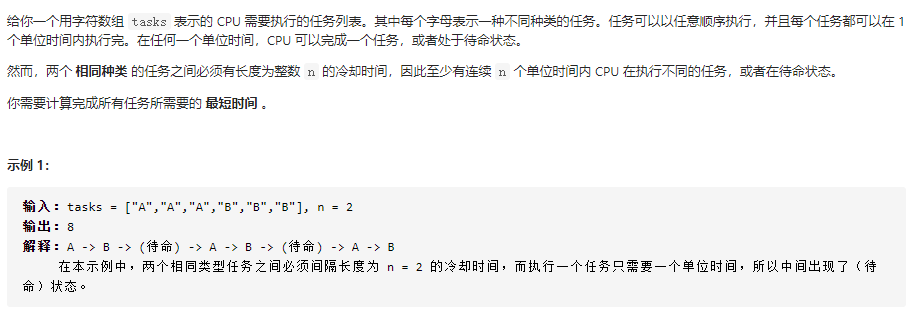

### 1.跳跃游戏

输入：nums = [2,3,1,1,4]
输出：true
解释：可以先跳 1 步，从下标 0 到达下标 1, 然后再从下标 1 跳 3 步到达最后一个下标。

思路：依次遍历数组中的每一个位置，并实时维护最远可以到达的位置。对于当前遍历到的位置 x，如果它在最远可以到达的位置的范围内，那么我们就可以用 x+nums[x] 更新最远可以到达的位置。在遍历的过程中，如果最远可以到达的位置大于等于数组中的最后一个位置，那就说明最后一个位置可达，我们就可以直接返回 True

```
class Solution(object):
    def canJump(self, nums):
        """
        :type nums: List[int]
        :rtype: bool
        """
        n = len(nums)
        rightmost = 0

        for i in range(n):
            if i <= rightmost:
                rightmost = max(rightmost, i+nums[i])
            else:
                return False
            if rightmost >= n-1:
                return True
```

### 2.任务调度器



Ref：https://leetcode-cn.com/problems/task-scheduler/solution/python-xiang-jie-by-jalan/

```
class Solution(object):
    def leastInterval(self, tasks, n):
        """
        :type tasks: List[str]
        :type n: int
        :rtype: int
        """
        length = len(tasks)
        if length <= 1:
            return length
        
        # 用于记录每个任务出现的次数
        task_map = dict()
        for task in tasks:
            task_map[task] = task_map.get(task, 0) + 1
        # 按任务出现的次数从大到小排序
        task_sort = sorted(task_map.items(), key=lambda x: x[1], reverse=True)
        
        # 出现最多次任务的次数
        max_task_count = task_sort[0][1]
        # 至少需要的最短时间
        res = (max_task_count - 1) * (n + 1)
        
        for sort in task_sort:
            if sort[1] == max_task_count:
                res += 1
        
        # 如果结果比任务数量少，则返回总任务数
        return res if res >= length else length
```